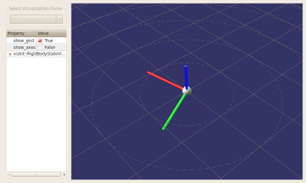

3D Data Visualization

<h2 id="abstract">Abstract</h2>

In this tutorial, you will learn how to display 3D data with the help of Vizkit.
For this tutorial, you should already have read the <a href="210_data_visualization.html">data visualization</a> tutorial.

<h2 id="vizkit-3d">Vizkit 3D</h2>

In Vizkit, there is a dedicated subsystem for displaying 3D Data. It is called Vizkit3D. The
basis for the 3D display is provided by a widget called &lsquo;Vizkit3dWidget&rsquo;, which is a vizkit widget.
On the Vizkit3dWidget, one may register Vizkit3d-Plugins for displaying individual 3D data structures
inside the widget. 

As all of this is pretty confusing, here the naming in short form :

<ul>
<li>VizkitWidget : 2D Widget </li>
<li>Vizkit3dWidget : The Vizkit-provided Vizkit that allows you to display 3D data</li>
<li>Vizkit3dPlugin : A plugin which is registered on the Vizkit3dWidget</li>
</ul>

<h2 id="how-to-use-it">How to use it</h2>

First, we need to create the Vizkit3dWidget. We could do this in the same way as
we create any other VizkitWidget (i.e. by using default_loader.create_widget),
but Vizkit provides a shortcut:

<pre><code class="language-ruby">require 'vizkit'
Orocos.initialize

## Create a widget for 3d display
view3d = Vizkit.vizkit3d_widget

# Show it
view3d.show
# And listen to GUI events
Vizkit.exec
</code></pre>

For this tutorial, we pick a plugin, that will show a simple 3D representation of a Pose
in space. Note that you can add multiple Vizkit3DPlugins to the Vizkit3DWidget
to create complex 3D visualizations.

Insert the following line before you call Vizkit.exec:

<pre><code class="language-ruby">rbs_plugin = Vizkit.default_loader.RigidBodyStateVisualization
</code></pre>

If you execute your script now, you should see a window with a sphere that is &lsquo;spiked&rsquo; with three cylinders.
By clicking inside the window and dragging, you should be able to change the view.

<h2 id="feeding-data-to-your-plugin">Feeding data to your plugin</h2>

So, how do we pass new data to our visualizer? Quite simple, we just call
&lsquo;updateRigidBodyState&rsquo; on it, before calling Vizkit.exec:

<pre><code class="language-ruby">rbs = Types::Base::Samples::RigidBodyState.new

rbs.position = Eigen::Vector3.new(0, 5.0, 0)
rbs.orientation = Eigen::Quaternion.new(0, 0, 0, 1)

rbs_plugin.updateRigidBodyState(rbs)
</code></pre>

Progress to the <a href="300_vizkit_widget.html">next tutorial</a>.

