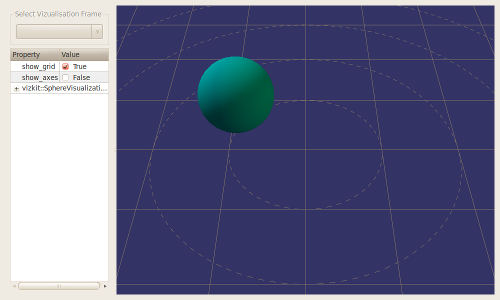

Writing a 3D Vizkit plugin

<h2 id="abstract">Abstract</h2>

In this tutorial you will learn how to create your own Vizkit plugin. Vizkit plugins are used for the 3d-data visualization.
The 3d-data visualization in Rock is based on OpenSceneGraph. For more informations and tutorials about OSG visit the <a href="http://www.openscenegraph.org/projects/osg/wiki/Support">OSG website</a>.
All examples created in this tutorial can be found in the /tutorials/vizkit3d_plugin_tutorial library.

<h2 id="implementation">Implementation</h2>

Normally you add a Vizkit plugin to an existing library to visualize data of this library.
For this tutorial we create a new library (using the command &lsquo;rock-create-lib&rsquo;) and name it vizkit3d_plugin_tutorial.
In the manifest.xml we have to add some dependencies:

<pre><code class="language-xml">...
&lt;!-- rock library dependencies --&gt;
&lt;depend package="gui/vizkit3d" /&gt;
&lt;depend package="base/types" /&gt;

&lt;!-- os dependencies --&gt;
&lt;rosdep name="osg" /&gt;
...
</code></pre>

Vizkit is the 3d-data visualization part of Rock and it depends on OpenSceneGraph (osg). And we are going to use some base types of Rock.

The next step is to create the viskit plugin inside the folder of this library using the following command:

<pre><code class="language-text">rock-add-vizkit
</code></pre>

You will be asked for the name and type of the plugin. The name should be a simple name as &lsquo;PathVisualization&rsquo;; it has to be without namespaces. The type is the type of data we want to display, e.g. base::Time (with namespace). In our case we create a plugin named &lsquo;SphereVisualization&rsquo; which will visualize data of type base::Vector3d.
After that all files we need for the plugin are created in a separated folder named &lsquo;viz&rsquo;.

In the header file we can see that this plugin inherits from vizkit3d::Vizkit3DPlugin&lt; base::Vector3d &gt;. From Vizkit3DPlugin it has a method updateData of parameter base::Vector3d. This method will be called later from orocos components or ruby scripts to update its internal state. But we only have to take care of the three virtual methods.
In the header file it self we have to add some includes and a pointer, base/Eigen.hpp because of the base::Vector3d we use and osg/PositionAttitudeTransform for the pointer spherePos. We add this pointer here to change later easily attributes of this object. With a osg::PositionAttitudeTransform we can modify the relative position and orientation of all child objects.

<pre><code class="language-cpp">#include &lt;boost/noncopyable.hpp&gt;
#include &lt;vizkit3d/VizPlugin.hpp&gt;
#include &lt;osg/Geode&gt;
#include &lt;osg/PositionAttitudeTransform&gt;
#include &lt;base/Eigen.hpp&gt;

namespace vizkit3d
{
  class SphereVisualization
      : public vizkit3d::Vizkit3DPlguin&lt;base::Vector3d&gt;
      , boost::noncopyable
  {
  public:
      SphereVisualization();
      ~SphereVisualization();

  protected:
      virtual osg::ref_ptr&lt;osg::Node&gt; createMainNode();
      virtual void updateMainNode(osg::Node* node);
      virtual void updateDataIntern(base::Vector3d const&amp; value);

  private:
      osg::ref_ptr&lt;osg::PositionAttitudeTransform&gt; spherePos;
      struct Data;
      Data* p;
  };
}
</code></pre>

In createMainNode we have to create an OSG node (e.g. osg::Geode, osg::Group, osg::Node), add to it all geometries we want to display and return it.
In our case want draw a simple sphere. Here we use the PositionAttitudeTransform as main node, to which we add a Geode as child. To this Geode we add a drawable Sphere.

<pre><code class="language-cpp">osg::ref_ptr&lt;osg::Node&gt; SphereVisualization::createMainNode()
{
  // create a sphere with radius 0.5
  osg::ref_ptr&lt;osg::Sphere&gt; sp = new osg::Sphere(osg::Vec3d(0,0,0), 0.5);
  osg::ref_ptr&lt;osg::ShapeDrawable&gt; sd = new osg::ShapeDrawable(sp.get());
  // set a color
  sd-&gt;setColor(osg::Vec4(0.0f, 0.59f, 0.59f, 1.0f));
  osg::ref_ptr&lt;osg::Geode&gt; spGeode = new osg::Geode();
  spGeode-&gt;addDrawable(sd.get());
  // attach it to a parent which is a osg::PositionAttitudeTransform
  spherePos = new osg::PositionAttitudeTransform();
  spherePos-&gt;addChild(spGeode);

  return spherePos;
}
</code></pre>

The updateMainNode is an update callback of OSG, it will be triggered if the internal states of the geometries can be updated.
So what we have to do here is to update our nodes using the data in p-&gt;data. We use our pointer spherePos to modify the position of our sphere.

<pre><code class="language-cpp">void SphereVisualization::updateMainNode ( osg::Node* node )
{
  // Update the main node using the data in p-&gt;data
  osg::Vec3d position(p-&gt;data.x(), p-&gt;data.y(), p-&gt;data.z());
  spherePos-&gt;setPosition(position);
}
</code></pre>

This method will be executed by the updateData method and updates the internal state of our type base::Vector3d.
We don&rsquo;t need to change here anything.

<pre><code class="language-cpp">void SphereVisualization::updateDataIntern(base::Vector3d const&amp; value)
{
  p-&gt;data = value;
}
</code></pre>

Vizkit runs in a separated task context but it is assured that updateMainNode and updateDataIntern won&rsquo;t be triggered at the same time.

Now you are done with your first Vizkit plugin. There are two different ways to execute the plugin, using an orocos task or only with a ruby script.
How you start it using a ruby script is part of the Advanced Vizkit-Plugin Tutorial.

<h2 id="displaying-more-than-one-type-with-a-single-plugin">Displaying more than one type with a single plugin</h2>

If you want to have more than one type to represent the internal state of your plugin you can inherit additionally from VizPluginAddType&lt; SecondType &gt;.

<pre><code class="language-cpp">namespace vizkit3d
{
class SphereVisualization
  : public vizkit3d::Vizkit3DPlugin&lt;base::Vector3d&gt;
  , public vizkit3d::VizPluginAddType&lt;int&gt;
  , boost::noncopyable
{
public:
  SphereVisualization();
  ~SphereVisualization();

protected:
  virtual osg::ref_ptr&lt;osg::Node&gt; createMainNode();
  virtual void updateMainNode(osg::Node* node);
  virtual void updateDataIntern(base::Vector3d const&amp; value);
  virtual void updateDataIntern(int const&amp; value);

private:
  struct Data;
  Data* p;
};
}
</code></pre>

Then of course you have to add the method updateDataIntern with the new type as parameter too.

<h2 id="configuration-interface">Configuration Interface</h2>

To add configuration parameters, one should use <a href="http://doc.qt.io/qt-4.8/properties.html">the Qt Property
system</a>. This makes sure that
the properties are accessible on the left configuration pane of the Vizkit3D
main window. For instance, to make the color configurable:

<pre><code class="language-cpp">namespace vizkit3d
{
class SphereVisualization
{
[...]
  Q_OBJECT
  Q_PROPERTY(QColor color READ getColor WRITE setColor);
public:
  void setColor(QColor const&amp; color);
  QColor getColor() const;
}
}
</code></pre>

<h2 id="interfacing-with-ruby-scripts">Interfacing with Ruby scripts</h2>

There is the need for slightly more work to make this new plugin available on
the Ruby side. This is done by using Qt&rsquo;s dynamic invocation system (the same
one that is used for Qt signals/slots).

To make your plugin available in Ruby, one has to do two things:

<ul>
<li>export the methods that one wants to have accessible on the Ruby side using
the Q_INVOKABLE Qt macro.</li>
<li>register the plugin on the Vizkit ruby side</li>
</ul>

The following limitations apply:

<ul>
<li>the method cannot have a return value</li>
<li>the method can have only up to 10 arguments</li>
</ul>

<strong>Exporting C++ methods</strong> In the SphereVisualization vizkit plugin above, the
updateData method would be exported by doing:

<pre><code class="language-cpp">namespace vizkit3d
{
class SphereVisualization
{
[...]
  // This is required manually as Qt does not know about templates and
  // updateData is a templated method
  Q_INVOKABLE void updateData(base::Vector3d const&amp; v)
  { vizkit3d::VizPluginBase::updateData(v) }
};
}
</code></pre>

Any method can be exported this way. It is for instance customary to mark the
setters and getters for configuration parameters with Q_INVOKABLE.

<strong>Registering the plugin on the vizkit side</strong>. When using the Rock CMake macros,
one would edit a file called viz/vizkit_plugin.rb in the package and add

<pre><code class="language-ruby"># The first argument is arbitrary. It is used in the next calls
#    to refer to the plugin
# The second argument is the name of the shared object (without the
#    -viz suffix). With Rock CMake macros, this is the base name of
#    your package (e.g. corridor_planner for planning/corridor_planner)
# The third argument is the name of the class, without namespaces
Vizkit::UiLoader.register_3d_plugin 'SphereVisualization',
  'mypackage', 'SphereVisualization'

# The first argument is the same as the first argument
#    to register_3d_plugin
# The second argument is the typelib type name of the type you want to
#    visualize. It is usually the same as the C++ type name, only with
#    a leading slash and :: replaced by /
# The third argument is the name of the method that should be called to
#   display the requested samples
Vizkit::UiLoader.register_3d_plugin_for 'SphereVisualization',
  '/base/Vector3d', :updateData
</code></pre>

<strong>Using the plugin</strong>. Once you&rsquo;ve successfully completed these steps, your new
plugin will be automatically be made available on the rock-replay and
rock-display GUIs. Moreover, it can be accessed in Ruby scripts directly:

<pre><code class="language-ruby">require 'vizkit'
viz = Vizkit.default_loader.SphereVisualization

# create an instance of the base type Vectro3d
position = Types::Base::Vector3d.new

# a global index
i = 0.0
# initialize timer
timer = Qt::Timer.new
timer.connect(SIGNAL('timeout()')) do
  i += 1.0
  j = i / 200.0
  position.x = Math::cos(j) * j
  position.y = Math::sin(j) * j
  position.z = 0.5
  viz.updateData(position)
end

# start the timer with a timeout of 10 ms
timer.start(10)
Vizkit.exec
</code></pre>

Progress to the <a href="620_multi_widget_display.html">next tutorial</a>.

