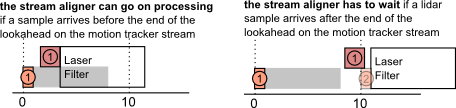

Processing Data - the Stream Aligner

The dataflow in component-based systems, like what happens in Rock, is done
asynchronously: components process data as it arrives. Since different
processing chains have different computation times, it means that our <a href="timestamping.html">carefully
timestamped data</a> will most probably arrive out-of-order at
the components that need it.

Let&rsquo;s see, as an example, the following processing chain:

In this chain, sensors are fused through two paths. One path processes lidar
data to remove outliers and body parts (laser filter). In another path, a stereo
camera rig is used to generate a separate point clouds. The two informations are
then merged to form a pointcloud that is represented in a frame that is
centered on the body, but aligned to the world (i.e. a tabletop would look
horizontal even if the robot&rsquo;s body is on an incline). To achieve this, a motion
tracker gives the pose of the body in the reference frame.

To add a bit more interesting effects, the lidar and cameras are mounted on a
tilt unit with a single servo motor. The position of these sensors w.r.t. the
body is therefore changing during operation. 

If the robot moves during acquisition, it is obviously critical that the &ldquo;right&rdquo;
association is made between the different channels. However, the different data
processing paths have widely different processing times. Indeed, a realistic
sample arrival diagram would look like:

In this diagram, both times, the pointcloud processing must make sure that it is
processing data that is properly associated in time. Moreover, this diagram does
not take into account that sensors have different acquisition latencies. It
would not be uncommon, in such a processing pipeline, that the first lidar
sample arrives <em>after</em> the second motion tracker (or servo) sample.

In Rock, there is one piece of software that handles these problems in a common
way: the stream aligner. As we will see later, this method has its drawbacks,
and might not be right for <em>your</em> problem. However, it has shown to be a good
solution in most cases.

<h2 id="stream-aligner-principles">Stream Aligner Principles</h2>

Rock&rsquo;s stream aligner (in the <a href="/pkg/drivers/aggregator/index.html">drivers/aggregator</a> package) ensures that
data is processed in order by (1) queueing timestamped data, and (2) calling
registered callbacks in the order of the timestamps.

The general principle is therefore that:

<ul>
<li>one callback is registered for each data stream</li>
<li>data is pushed as it arrives in the corresponding streams. The leading
assumption is that, on each stream, the timestamps are monotonous (they don&rsquo;t
go back in time).</li>
<li>the respective callbacks get called when it is time to process the relevant
samples. This is done only when the stream aligner determined that no sample
from other streams can arrive with an earlier timestamp then the one that is
being passed to a callback.</li>
</ul>

We&rsquo;ll now see how the decision is being made.

<h2 id="period-latency-and-stream-aligner-timeout">Period, latency and stream aligner timeout</h2>

Let&rsquo;s look at the example of the laser filter again:

If, as this diagram shows, the laser filter starts processing as soon as the
lidar sample arrives, it means that the stream aligner would, in this case, have
determined that it is impossible that a motion tracker sample arrives in between
the first motion tracker and first lidar samples.

With no additional information, however, the stream aligner would have to wait
that another sample arrives on the motion tracker <em>before</em> processing the first
laser sample:

Which builds up latency &hellip;

To avoid this, the stream aligner allows to set a <em>period</em> parameter on each
stream. This period parameter (which is also called lookahead in event-based
systems) is the time after a sample in which there is a guarantee that no other
sample arrives. It is called <em>period</em> in the stream aligner as it is the value
of the input periods, for periodic inputs such as common robotic sensors. When
visualizing the period, the above example looks therefore like:

Because processing based on the stream aligner is based on the fact that samples
are passed in-order, the stream aligner <strong>must</strong> drop samples that arrive &ldquo;in
the past&rdquo;, i.e. that arrive with an earlier timestamp that the last sample
&ldquo;played&rdquo; by the stream aligner. So, it is better to give a period that is
<strong>lower</strong> than the actual sensor period so that the aligner does not drop
samples unnecessarily.

In order to not wait forever for samples that will never arrive (lost samples),
the stream aligner also allows to set a <strong>timeout</strong> parameter, which is the
highest latency that the aligner would allow to build up. When the latency
induced by the stream aligner is higher than this value, the aligner starts
playing queued samples <strong>regardless</strong> of the fact that, in principle, some
samples should arrive on the other streams. If these samples do arrive anyway,
they will therefore get dropped. This parameter is therefore a trade-off between
the maximum latency that the processing chain can accept and how exact the
result needs to be.

<h2 id="using-the-stream-aligner">Using the stream aligner</h2>

As in all of Rock, the stream aligner is implemented as a pure C++ library that
can be used outside of Rock&rsquo;s component framework. The API of this library will
not be detailed in this documentation. Go to the <a href="/pkg/drivers/aggregator/index.html">drivers/aggregator</a> package documentation for more details.

The most interesting usage of the stream aligner is within oroGen components.
Rock provides an oroGen plugin that extends the oroGen specification and
generates code and oroGen interface elements to control the stream aligner. <a href="stream_aligner_orogen.html">The
following page</a> will explain the usage of this
plugin. The <a href="stream_aligner_runtime.html">next page</a> will then detail how it can
be parametrized and monitored in practice.

