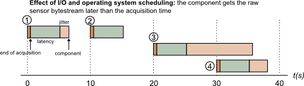

  ... API and oroGen usage

<h2 id="the-timestampestimator-class">The TimestampEstimator class</h2>

The TimestampEstimator class, which lies in the aggregator package, is used to
remove the jitter out of a periodic time stream. Basically, once configured, one
gives it a time in a time series that (1) is periodic (2) can (rarely) contain
lost samples and/or bursts, and returns the best estimate for the provided
time.

One design criteria for this class is that it has to be zero-latency, i.e. the
timestamp estimator never delays the processing of a sample.

<h2 id="timestamper-usage">Timestamper Usage</h2>

Since the timestamper relies on being provided most of the time events in the
periodic time stream it is estimating, it is, in Rock, usually not used in the
drivers. It is integrated in the oroGen tasks instead. As usual in Rock, it is
a separate C++ library, so it can also be used in other C++ libraries outside of
oroGen.

However, this page will describe the usage in the context of oroGen.

To use it, one first adds the aggregator package in the list of dependencies and
adds the corresponding using_library statement in the orogen file:

The manifest.xml:

<pre><code class="language-xml">&lt;depends package="drivers/orogen/aggregator" /&gt;
</code></pre>

The orogen file:

<pre><code class="language-ruby">using_library "aggregator"
import_types_from "aggregator"
</code></pre>

Finally, one declares an aggregator::TimestampEstimator instance variable in the
task&rsquo;s header, initializes it to NULL in the task&rsquo;s constructors.

Additionally, the estimator is supposed to be

<ul>
<li>created in the configureHook of the task</li>
<li>reset in the stopHook of the task</li>
<li>deleted in the cleanupHook</li>
</ul>

At creation time, one parameters is required: the estimation window. The
timestamp estimator continuously estimates the device period by averaging the
duration between successive samples on a certain time window. For stability
reaons, that time window should be chosen pretty big (~ 20s is usually a good
starting point). If your device period is known to drift, you should choose a
window that is at most 10% of any significant drift time (i.e. if the period
changes more than 10% after 10s, the window should be at most 1s)

Additionally, it is recommended to provide the expected device period. At
initialization, the estimator does not have any information about the time
stream it has to estimate, which makes it initially very sensible to jitter
(i.e. the estimated times will be pretty bad). Providing an expected period &ndash;
which is usually available from the device type and configuration &ndash; improves
the initial estimation quite a lot.

As an example, the setup of the Xsens IMU, when configured at 10Hz, would be:

<pre><code class="language-cpp">mTimestamper = aggregator::TimestampEstimator(
 base::Time::fromSeconds(10),
 base::Time::fromMilliseconds(10));
</code></pre>

Then, in the updateHook, one gets its best estimate with:

<pre><code class="language-cpp">  data = mDriver-&gt;getSample();
data.time = mTimestamper-&gt;update(data.time);
</code></pre>

Do <strong>not</strong> forget to reset the estimator in the startHook (or stopHook)

<pre><code class="language-cpp">mTimestamper-&gt;reset();
</code></pre>

<h2 id="handling-bursts-and-lost-packages">Handling bursts and lost packages</h2>

The main issue here is that late samples look very much &ndash; from the point of
view of the estimator &ndash; like lost samples.

Let&rsquo;s take our IMU, and see a realistic case for latency and jitter during execution:

In this example, when the component receives sample 3, how can it know whether it <strong>is</strong> sample
3 or sample 4 ? Indeed, sample 3 is received <strong>after</strong> the expected minimum
reception time of sample 4, so it could either be sample 4 early or sample
3 very late.

In case of actual bursts (i.e. when the component receives multiple samples at
once), the same issue arises: since the estimator is not allowed by design to
store samples.

This situation can ideally be solved by indexes provided by the sensor. Some
sensors count how many samples it generated so far and provides this information
<strong>inside the data stream itself</strong>. In this case, this index can be explicitely
provided to the estimator (<strong>you have to be careful about wraparounds</strong>).

<pre><code class="language-cpp">data.time = mTimestamper-&gt;update(data.time, mDriver-&gt;getIndex());
</code></pre>

If no index is available, the estimator itself has a threshold-based mechanism
to choose between the lost sample case or the delayed sample case. The last
parameter of the constructor provides a loss_limit number of periods:

<ul>
<li>if a sample i+1 is received and t(i+1) - t(i) &lt;= P*loss_limit, then the
estimator will think that the sample has been delayed</li>
<li>if a sample i+1 is received and t(i+1) - t(i) &gt; P*loss_limit, then the
estimator will think that one sample has been lost.</li>
</ul>

Finally, if you have a mean to determine data loss other than the index, you can
announce lost samples to the estimator:

<pre><code class="language-cpp">mTimestamper-&gt;updateLoss();
</code></pre>

<h2 id="estimating-latency-through-hardware-timestamps">Estimating latency through hardware timestamps</h2>

As we already explained, a lot of sensors nowadays provide hardware pulses that
announce a precise event in their data acquisition process. If such a source is
available to you, these (properly timestamped) events can be fed to the
estimator with

<pre><code class="language-cpp">mTimestamper-&gt;updateReference(hardware_time);
</code></pre>

where hardware_time is a base::Time object;

<h2 id="timestampestimator-at-the-orogen-level">TimestampEstimator at the oroGen level</h2>

The parameters from the timestamp estimator are mostly internal (i.e. can be
determined by the component itself). The only parameter that is system-specific
is the loss_threshold (to determine if a sample is lost or delayed).

If the device for which you write a component does not provide other means to
determine sample loss, then it is advised to define a property called
&ldquo;sample_loss_threshold&rdquo; of type int to parametrize this option. The default
value for it should be 2 (unless your device, by itself, has a bursty
behaviour).

in the task_context block of your oroGen file:

<pre><code class="language-ruby">property("sample_loss_threshold", "int", 2).
 doc "timestamp estimator configuration"
</code></pre>

And in the configureHook, add a parameter to the constructor (3rd parameter)

<pre><code class="language-cpp">mTimestamper = aggregator::TimestampEstimator(
 base::Time::fromSeconds(10),
 base::Time::fromMilliseconds(10),
 _sample_loss_threshold.get());
</code></pre>

Moreover, it is also advised to output the timestamp estimator&rsquo;s status
structure on a port called &ldquo;timestamp_estimator_status&rdquo;:

In the oroGen file:

<pre><code class="language-ruby">output_port "timestamp_estimator_status", "/aggregator/TimestampEstimatorStatus"
</code></pre>

In the updateHook:

<pre><code class="language-cpp">_timestamp_estimator_status.write(mTimestamper.getStatus());
</code></pre>

Finally, if your device does offer external triggering / hardware pulses, you
should also add a &ldquo;hardware_timestamps&rdquo; input port of type base::Time that will
be fed to the estimator:

In the oroGen file:

<pre><code class="language-ruby">output_port "hardware_timestamps", "/base/Time"
</code></pre>

In the updateHook:

<pre><code class="language-cpp">base::Time hw_time;
while (_hardware_timestamps.read(hw_time) == RTT::NewData)
 mTimestamper-&gt;updateReference(hw_time);
</code></pre>

