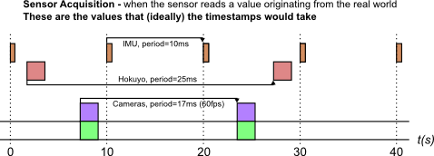
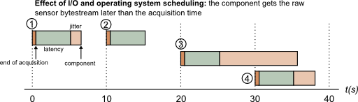

The timestamp estimator

Let&rsquo;s look at a standard data acquisition process in a robotic system. As we
already stated, our goal is to estimate, as closely as possible, <em>when</em> the data
has been acquired by the sensor.

Let&rsquo;s assume we have a system with four sensors: an IMU, a laser scanner and two
cameras (for the purpose of explaining the timestamping process, only the IMU
will be used).

Ideally, timestamping would match the sensor acquisition times:

However, timestamping the data that originates from the sensors is a task that
is hindered by phenomenons in the data acquisition chain: sensor acquisition
process, communication between the sensor and the CPU, operating system
scheduling (when the driver process gets executed once the data arrived) and &ndash;
last but not least &ndash; clock synchronization in multi-CPU (and therefore
multi-robot) systems.  Fortunately for us, a few of these can be estimated
offline and/or online.

This estimation of the time difference between an event and when this event is
measured is commonly separated between a mean <em>latency</em> (constant part)
and a <em>jitter</em> (variability).

<h2 id="filtering-jitter">Filtering jitter</h2>

Since most sensors have a fixed acquisition period, the jitter can be filtered
out over time by estimating the average sensor period and base time. In Rock,
this is done by the aggregator::TimestampEstimator class <a href="timestamp_estimator_usage.html">that is described in
the next page</a>.

<h2 id="estimating-latency">Estimating latency</h2>

The average latency, however, is a different issue altogether. It
originates from different sources, each of which have to be solved by different
means:

<strong>Sensor</strong> the latency in the sensor acquisition process is usually documented (or
can at least be informally given by the company producing this sensor). In case of sensors
developed in-house, this value can be estimated.

<strong>Communication layer</strong> a rough estimate can usually be obtained by looking at the
amount of data and the communication layer bandwidth.

<strong>Operating system</strong> is the weak part of the chain if one does not use a
hard-realtime operating system such as Xenomai or QNX <em>or</em> has devices that are
not compatible with that realtime operating system. However, some communication layers timestamp
messages at the driver level (for instance, CAN and firewire stacks on Linux systems). For other layers, no
information can be obtained directly.

<strong>Clock synchronization</strong> clock synchronization solutions like NTP are available
to synchronize multiple CPUs. However, they take long to converge, especially over
wireless networks (if they converge at all), making it practical only on systems that are
up most of the time. Additionally to NTP, outdoors, one can use GPS as a time source.
Indoors, no really good solution exist to our knowledge.

<strong>Throwing hardware at the task</strong> It became common for sensors used in robotic
applications to have so-called hardware synchronization signals that announce a particular event (for instance,
start of acquisition), or hardware triggers that allow to pick the point of acquisition
(common on cameras). Using adapted hardware and combined with the techniques proposed
above, this method allows to achieve data timestamping of the order of one milliseconds,
regardless of the operating system properties. The TimestampEstimator class also
accepts a separate stream of timestamps that it is using to estimate the
latency. Check out the next page for details.

