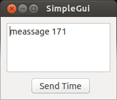

Developing a Simple GUI

Vizkit is a quit powerful tool to connect Qt widgets written in C++ or ruby with Orocos
tasks. It is based on Orocos::Async API and
<a href="http://techbase.kde.org/Development/Languages/Ruby">qtruby</a>.

Main Features:

<ul>
 <li>event driven design which fits well to qt slots and signals</li>
 <li>asynchronous communication with Orocos tasks</li>
 <li>auto connect and reconnect </li>
 <li>connection sharing across all data consumer and producer belonging to the same ruby process</li>
 <li>unified error handling and propagation</li>
</ul>

To show how to create a simple
<a href="https://raw.githubusercontent.com/rock-core/base-doc/master/src/documentation/graphical_user_interface/simple_gui.ui">GUI</a>,
a small example is used consisting of
three elements.  A window, a button and a text field. The text field displays
text messages send by a remote task and if the button is clicked a message is
sent from the GUI to the remote Orocos task.

The following code connects the GUI generated by the Qt Designer with a remote
task called
<a href="https://raw.githubusercontent.com/rock-core/base-doc/master/src/documentation/graphical_user_interface/simple_task.rb">simple_task</a>.
For this Vizkit uses the default CORBA name service to resolve the task name and
automatically reconnects if the task was restarted.

<pre><code class="language-ruby"># loading library
require 'vizkit'

# initialize Orocos layer
Orocos.initialize

# load GUI created with the Qt Designer
widget = Vizkit.load "simple_gui.ui"
widget.show

# connect the widget with the task "simple_task"
widget.connect_to_task "simple_task" do |task|

   # connect the output port text_message with the text box slot setText
   text_box.connect PORT(:text_message), SLOT("setText(QString)")

   # generate a new sample each time the button is clicked
   # and show a message box if there is a connection error
   g = lambda{"it is #{Time.new.to_s}"}
   c = lambda{|msg| Qt::MessageBox.warning(widget,"ComErr",msg) if msg != "OK"}
   button.connect SIGNAL(:clicked), PORT(:input),:getter =&gt; g,:callback =&gt; c

   # disable the GUI until the task is reachable
   task.on_reachable {widget.setEnabled(true)}
   task.on_unreachable {widget.setEnabled(false)}
end

#run qt main loop
Vizkit.exec
</code></pre>

In the next example Vizkit is used to display the images taken by a camera.  If
Vizkit cannot find a specialised widget to visualize a message a tree view
widget is used to display all data fields. This mechanism can easily be extended
by custom widgets (see <a href="600_writing_vizkit_widget.html">this page</a>)

<pre><code class="language-ruby">require 'vizkit'
Orocos.initialize

# create a TaskContextProxy which automatically connects to a remote task
# called "camera" when available
camera = Orocos::Async.proxy("camera")

# display output port frame as soon as the port is reachable
camera.port("frame").once_on_reachable do
   Vizkit.display camera.port("frame")
end

Vizkit.exec
</code></pre>

Each Orocos::Async object has a number of events which can be used to change the state
of GUI. The most important ones are listed below.

<pre><code class="language-ruby"># create a TaskContextProxy which automatically connects to a remote task
# called "camera" when available
camera = Orocos::Async.proxy("camera")
port = camera.port("frame")

camera.on_reachable do
   puts "camera is reachable"
end
camera.on_unreachable do
   puts "camera is no longer reachable"
end
camera.on_error do |error|
   puts "camera error #{error}"
end
camera.on_state_change do |state|
   puts "camera state changed to #{state}"
end

port.on_reachable do
   puts "port is reachable"
end
port.on_unreachable do
   puts "port is no longer reachable"
end
port.on_error do |error|
   puts "port error #{error}"
end
port.on_data do |data|
   puts "port received #{data}"
end
</code></pre>

