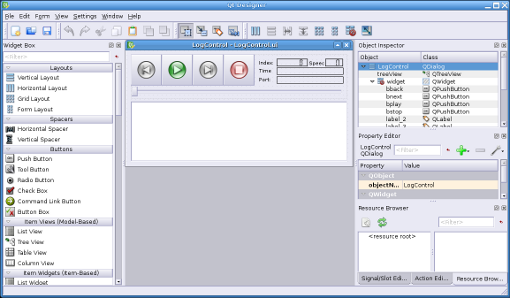

Qt Designer

A graphical user interface can be developed either by writing source
or a WYSIWYG editor like qt designer can be used to add and
arrange all widgets.  To support the developer in the best possible way there
is no need to convert the ui to another format it can be directly loaded by
Vizkit. After the ui file is loaded all widgets can be accessed by their object
name and all available slots and signals can be called on them. 

Example for loading a ui file which defines a text field with the object
name my_text_filed.

<pre><code class="language-ruby">  require 'vizkit'
widget = Vizkit.load 'my.ui'
#call the slot setText on the text field
widget.my_text_filed.setText 'Hello Rock!'
widget.show
Vizkit.exec
</code></pre>

