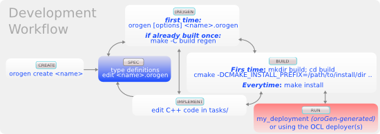
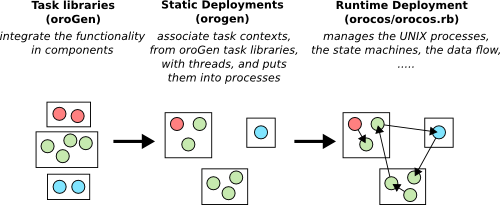

The Workflow

<h2 id="what-are-orogen-and-typegen">What are oroGen and typeGen</h2>

oroGen is a specification language and code generator for the <a href="http://www.orocos.org/rtt">Orocos Realtime
Toolkit (RTT)</a>. Orocos RTT is a C++ library allowing to build
component-based systems. The orogen tool allows to create new components easily.

In oroGen, one writes a specification that describes the component you want to
develop. Then, orogen generates the corresponding C++ code and CMake build
system so that you &ndash; the component developer &ndash; has only to care about
implementing the actual functionality.

oroGen has a smaller sibling, typeGen, that can be used to <a href="type_definitions.html">generate standalone
typekits</a>

In any case, the following documentation is meant

<h2 id="tutorials">Tutorials</h2>

<a href="../tutorials/index.html">The Rock tutorials</a> are a great introduction to oroGen
concepts and development workflow within Rock

<h2 id="the-development-workflow">The Development Workflow</h2>

The most important point is that you <strong><em>cannot</em></strong> use your component/typekit
before you have installed it. So, don&rsquo;t forget to do &lsquo;make install&rsquo;

<h2 id="the-runtime-workflow">The Runtime Workflow</h2>

One very important point when developing with Rock (actually, with Orocos/RTT
components), is that the <em>system deployment</em> is separated from the <em>component
implementation</em>.

What it means in practice is that a task context (a.k.a. &ldquo;RTT component&rdquo;) is a
standalone C++ class that can be integrated in different ways, instanciated
multiple times and so on.

oroGen keeps that separation. When you define components in oroGen, you create a
<em>task library</em>, which is a shared library in which the task context classes are
defined. Then, you need to put these libraries in <em>deployments</em> (which is also
done by oroGen). Finally, you can start these deployments, connect the tasks
together, monitor them using either <a href="../runtime/index.html">the orocos.rb Ruby
bindings</a> or the <a href="../system/index.html">advanced system
deployment</a>. They can also be used as <a href="../data_analysis/index.html">targets for log
replay</a>.

