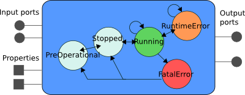

Task Interface

                
We&rsquo;ll cover in this page how to define your task&rsquo;s interface. All statements
presented in this page are to be included in a task context definition, i.e.
between &lsquo;do&rsquo; and &lsquo;end&rsquo; in

<pre><code class="language-ruby">task_context "ClassName" do
 ...
end
</code></pre>

The only constraint is that the task name <em>must</em> be different from the project
name. This is because, on the generated C++ code, the project name is mapped
into a namespace and the task name as a class name. Having a class and a
namespace have the same name is generates quite a bit of ambiguity on the C++
side, so it is forbidden.

The task interface is the focus of that page. Other issues, as using different
triggering modes and subclassing between task contexts is covered later.

<h2 id="interface-elements">Interface Elements</h2>

<ul>
<li><strong>Ports</strong> are used to transfer data between the components</li>
<li><strong>Properties</strong> are used to store and set configuration parameters</li>
<li>Finally, <strong>Operations</strong> (not represented here) are used to do remote method
calls on the components</li>
</ul>

As a general rule of thumb, the components should communicate with each other
only through ports. The properties and operations (as well as the state machine
covered in <a href="task_states.html">the next page</a>) are meant to be used by
a coordination layer (in the Rock case, either Ruby scripts or the model-based
management layer).

<h2 id="limits-on-types-used-in-the-interface">Limits on Types Used in the Interface</h2>

Unfortunately, oroGen has to cope with RTT limited support for basic types (int,
long, &hellip;), and therefore the following limitations apply:

<strong>Some limitations on types used in the task interface</strong>

<ul>
  <li>char, short, 64 bit integers and float are forbidden as argument types for a
operator and as properties. Use int instead of char or short, and
double instead of float. Unfortunately there is no equivalent for 64 bit
integers.</li>
  <li>they can always be used as elements in a struct, though</li>
  <li>structs that contain 64 bit integers won&rsquo;t be marshallable as XML.</li>
  <li>there is no typelib marshalling - and hence no data logging - for basic types
(int, double, float, &hellip;). They work fine when used in a structure,
obviously.</li>
</ul>

<h2 id="ports">Ports</h2>

Ports are defined with

<pre><code class="language-ruby">input_port('in', 'my_type').
doc('documentation string')
output_port('out', 'another_type').
doc('documentation string')
</code></pre>

Input ports can be used in the C++ code in two ways, which one you want to use
depends on what you actually want to do.

<ul>
<li>if you want to read all new samples that are on the input (since an input port
can be connected to multiple output ports)</li>
</ul>

<pre><code class="language-cpp">// my_type is the declared type of the port
my_type sample;
while (_in.read(sample) == RTT::NewData)
{
  // got a new sample, do something with it
}
</code></pre>

<ul>
<li>if you are just interested by having some data</li>
</ul>

<pre><code class="language-cpp">// my_type is the declared type of the port
my_type sample;
if (_in.read(sample))
{
  // got a sample, do something with it
}
</code></pre>

Finally, to write on an output, you use &lsquo;write&rsquo;:

<pre><code class="language-cpp">// another_type is the declared type of the port
another_type data = calculateData();
_out.write(data);
</code></pre>

Another operation of interest is the <tt>connected()</tt> predicate. It tests if
there is a data provider that will send data to input ports
(<tt>in.connected()</tt>) or if there is a listener component that will get the
samples written on output ports.

For instance,

<pre><code class="language-cpp">if (_out.connected())
{
  // generate the data for _out only if somebody may be interested by it. This
  // is useful if generating // the data is costly
  another_type data = calculateData();
  _out.write(data);
}
</code></pre>

<h2 id="properties">Properties</h2>

Properties are defined with

<pre><code class="language-ruby">property('name', 'configuration_type').
  doc 'what this property is about'
</code></pre>

And can be accessed in the code with

<pre><code class="language-cpp">configuration_type configuration_value = _name.get();
// Validate configuration_type, and change the value
_name.set(configuration_value)
</code></pre>

<h2 id="operations">Operations</h2>

The operations offer a mechanism from which a task context can expose
functionality through remote method calls. They are defined with:

<pre><code class="language-ruby">operation('commandName').
  argument('arg0', '/arg/type').
  argument('arg1', '/example/other_arg')
</code></pre>

Additionally, a return type can be added with

<pre><code class="language-ruby">operation('operationName').
  returns('int').
  argument('arg0', '/arg/type').
  argument('arg1', '/example/other_arg')
</code></pre>

Note the dot at the end of all but the last line. This dot is important and,
if omitted, will lead to syntax errors.

In the generated task class, the operation simply maps to a C++ method:

<pre><code class="language-cpp">return_type operationName(arg::type const&amp; arg0, example::other_arg const&amp; arg1);
</code></pre>

the default return type is &lsquo;void&rsquo;.

By default, the operations are run into the callee thread, i.e. the thread of
the task context on which the operation is defined. However, it basically means
that, if the caller needs the result of the operation, it will have to wait
until the operation is finished and therefore start to have quite a coupling
with the task context that executes the operation.

If it is desirable, one can design the operation&rsquo;s C++ method to be thread-safe
and declare it as being executed in the caller thread instead of the callee
thread. This is done with

<pre><code class="language-ruby">operation('operationName').
  returns('int').
  argument('arg0', '/arg/type').
  argument('arg1', '/example/other_arg').
  runs_in_caller_thread
</code></pre>

<h2 id="c-objects-representing-the-interface-elements">C++ objects representing the interface elements</h2>

For each element of the interface, Orogen declares the corresponding RTT C++
object as an attribute of the task implementation. The attribute&rsquo;s name is the
object name with an underscore prepended. For instance, the operation declared
with

<pre><code class="language-ruby">operation('operationName')
</code></pre>

is mapped to an attribute named <tt>_operationName</tt>, of type <tt>RTT::Operation</tt>.

The mappings are as follows:

<ul>
<li>operations are instances of RTT::Operation</li>
<li>input ports are instances of RTT::InputPort</li>
<li>output ports are instances of RTT::OutputPort</li>
<li>properties are instances of RTT::Property</li>
</ul>

Refer to the RTT&rsquo;s documentation to learn more on the operations available on
these objects.

<h2 id="default-and-required-activities">Default and required activities</h2>

When deployed in a system, a task context is assigned an activity. This activity
defines how the component should be triggered.

In all generality, any component should be able to support any kind of activity.
However, not giving any hint about what would be a &ldquo;best&rdquo; activity for a
component makes it very hard for people to use such component.

In order to make life easier, oroGen allows you to propose a default activity
for your task contexts. This is done with

<pre><code class="language-ruby">default_activity "activity_type", activity_parameters
</code></pre>

The available triggering mechanisms are detailed <a href="triggering/index.html">here</a>.
They can be declared as default activities with

<pre><code class="language-ruby">default_activity 'periodic', 0.1 # periodic activity wit a period of 100ms
default_activity 'fd_driven'     # IO-driven activity
default_activity 'triggered'     # triggered by external events, i.e. explicit
                               # calls to trigger() or data-driven task
</code></pre>

Note that fd_driven and triggered do not usually need to be specified.
&lsquo;triggered&rsquo; is the default activity and &lsquo;fd_driven&rsquo; is set as default activity
if you use <a href="triggering/fd.html">the fd_driven statement</a>.

Finally, one can force the deployment to use an activity by replacing
&ldquo;default_activity&rdquo; by &ldquo;required_activity&rdquo;.

<h2 id="dynamic-ports">Dynamic Ports</h2>

Some components (e.g. the logger or the canbus components) may create new ports
at runtime when one of their operations is called. While not strictly necessary
in day-to-day operations, some of the model-based tooling (namely, rock-roby)
may require hints that this creation is possible. This is done with the
dynamic_input_port and dynamic_output_port declarations, possibly using a
regular expression as name pattern and either a message type or nil for &ldquo;type
unknown&rdquo;. For instance

<pre><code class="language-ruby">dynamic_output_port /.*/, "canbus/Message"
</code></pre>

declares, in the <a href="/tasks/canbus::Task.html">canbus::Task</a>, that ports with
arbitrary names might be added to the task interface, and that these ports will
have the /canbus/Message type.

