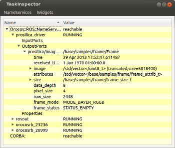

Example

In this page, we will detail &ndash; as an example &ndash; how the ROS prosilica camera
output can be displayed using vizkit. (To use the camera with ROS check the tutorials
at http://ros.org/wiki/prosilica_camera/Tutorials/)

To be able to use Rock&rsquo;s visualization tools, add the following to the
layout section of autoproj manifest (autoproj/manifest):

<pre><code> - gui/vizkit
</code></pre>

Now, update and build. 

<h2 id="step-1-data-type-convertion">Step 1: Data Type Convertion</h2>

We want to be able to convert the ROS image message into its Rock
equivalent, the base::samples::frame::Frame type.

Since base::samples::frame::Frame is declared in the base/orogen/types oroGen
project, we go there (base/orogen/types/base.orogen) and add the
necessary ROS-to-Rock mapping declaration (if not yet present):

<pre><code class="language-ruby">typekit.ros_mappings '/base/samples/frame/Frame' =&gt; 'sensor_msgs/Image'
</code></pre>

And run amake once

<pre><code>amake
</code></pre>

For the conversion between ROS and Rock to work we then have to fill in conversion functions.
Stubs for the conversion functions are automatically generated, i.e. if there was no ROS mappings
in the package before, just edit typekit/ROSConvertions.cpp. Otherwise, we have
to copy the relevant signatures from templates/typekit/ROSConvertions.hpp and
.cpp into the corresponding files in the typekit/ subfolder.

<pre><code>namespace ros_convertions {
   ...
   void toROS( sensor_msgs::Image&amp; ros,
          ::base::samples::frame::Frame const&amp; value );

   void fromROS( ::base::samples::frame::Frame&amp; value,
           sensor_msgs::Image const&amp; ros );
}
</code></pre>

Once the functions are filled in, simply build with

<pre><code>amake
</code></pre>

<h2 id="step-2-runtime-setup-via-topics">Step 2: Runtime Setup via Topics</h2>

At the setup level, getting hold on a topic is as simple as getting hold on a
port. For instance, the equivalent of the &ldquo;rostopic echo&rdquo; command would be:

<pre><code class="language-ruby">require 'orocos'
Orocos.initialize

topic = Orocos::ROS.topic ARGV.first
reader = topic.reader :type =&gt; :buffer, :size =&gt; 10
while true
 while value = reader.read_new
   pp value
   sleep 0.01
 end
end
</code></pre>

Using the connection API as if it was a Rock component, one can then connect the
nodes to the task contexts. 

Assuming we have one ROS-driven camera (/prosilica_driver), you can use vizkit to display
the image using the ROS node&rsquo;s topic:

<pre><code class="language-ruby">require 'vizkit'
require 'orocos'
Orocos.initialize

image_raw = Orocos::ROS.topic '/prosilica/image_raw'

Vizkit.display image_raw
Vizkit.exec
</code></pre>

<h2 id="step-3-using-the-rock-tooling">Step 3: Using the Rock tooling</h2>

The ROS integration allow you to use ROS nodes similarly to TaskContexts,
i.e. it maintains the same user experience for ROS nodes and oroGen tasks.
For the tooling to work,
the orocos.rb library maps the ROS graph into a
structure that maps the Rock component structure. In other words, a given ROS
node will have &ldquo;input ports&rdquo; and &ldquo;output ports&rdquo;. The former are the topics it is
subscribed to and the latter the topics that it is publishing.

First of all use rock-display (comes with gui/vizkit) to check for available ROS services:   

<pre><code>rock-display
</code></pre>

Correspondingly, in a Ruby script, one can get hold of a ROS node object through the standard name service
interface:

<pre><code class="language-ruby">camera = Orocos.name_service.get '/prosilica_driver'
</code></pre>

and give that to APIs that expect Orocos task, e.g. assuming that we have a stereo task
which relies on image data from one ROS-driven camera (/prosilica_driver) and one
Rock-driven one:

<pre><code class="language-ruby">require 'orocos'
Orocos.initialize

Orocos.run 'camera_prosilica::Task' =&gt; 'right_camera', 'stereo::Task' =&gt; 'stereo' do
 left_camera  = Orocos.name_service.get '/prosilica_driver'
 right_camera = Orocos.name_service.get 'right_camera'
 stereo       = Orocos.name_service.get 'stereo'

 left_camera_frame = left_camera.find_output_port('/prosilica/image_raw')
 right_camera.frame.connect_to stereo.right_frame
 left_camera_frame.connect_to stereo.left_frame

 right_camera.configure
 stereo.configure
 right_camera.start
 stereo.start
 Orocos.watch(stereo, right_camera) # Cannot watch a ROS node
end
</code></pre>

All the Orocos connection policies can be applied when connecting a ROS node
with a Rock component.

