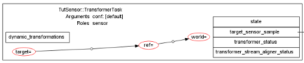

Transformer

The result of this tutorial can be found in bundles/tutorials if you
followed the instructions at the bottom of <a href="../tutorials/index.html">this page</a>.
While the tip of the master branch contains the accumulated result of all the
tutorials, you can get the specific result of this one by checking out the
transformer tag with

<pre><code>git checkout transformer
</code></pre>

In a nutshell, Rock&rsquo;s transformer is a mean to handle computation of forward
kinematic chains in a component network. It allows each component to declare
that it needs a given transformation between two declared frames and <em>get it</em>,
without the component itself having to care <em>how</em>. You should read <a href="../data_processing/transformer.html">this
page</a> as an introduction to the
transformer.

When using a system like the transformer, or ROS&rsquo; tf if you are familiar with
it, it gets quickly difficult to ensure that all the frames used in the network
are consistent. In a dynamic network, such as what Syskit enables, it is even
more difficult: which frames are relevant for a particular component depends on
which inputs and outputs it is connected to.

This tutorial will guide you through the transformer usage in Syskit, as well as
what Syskit brings on the table w.r.t. reconfiguration and consistency-checking. It
will do so by using tut_sensor::TransformerTask, a drop-in replacement for
tut_sensor::Task component that uses the transformer, a modification we prepared
for <a href="900_reusing_profiles.html">in the previous tutorial</a>.

<h2 id="enabling-the-transformer">Enabling the transformer</h2>

Syskit&rsquo;s transformer plugin needs to be enabled explicitly. Uncomment the
following line in config/init.rb (all bundles created with rock-create-bundle
have this line).

<pre><code class="language-ruby">Syskit.conf.transformer_enabled = true
</code></pre>

<h2 id="assigning-expected-frames">Assigning Expected Frames</h2>

Let&rsquo;s now try to resolve the transformer-enabled follower:

<pre><code># syskit instanciate -rtut-transformer follower_def!
could not find a frame assignment for target in TutSensor::TransformerTask:0x4880000{conf =&gt; [default]}[] (Transformer::MissingFrame)
</code></pre>

Click on &ldquo;Show transforms&rdquo; in the dataflow view, and have a look at the
TransformerTask task:

This shows the frames that TransformerTask requires. These are declared when
writing the component. Indeed, if you look at <a href="https://gitorious.org/rock-tutorials/orogen-tut_sensor">tutorials/orogen/tut_sensor</a>:

<pre><code class="language-ruby">transformer do
# We need a reference frame (the follower's body) and the target frame
# (the leader body frame)
transform 'target', 'ref'
# Because the rocks reference frames are attached to the body (they
# 'roll', we also need the transformation from the world to the reference
# frame)
transform 'ref', 'world'
max_latency 1
end
</code></pre>

How this works in Rock is that the frame names declared in the component are
<strong>local</strong> to the component. One needs to provide a mapping between the names of
these local frames and the corresponding actual names on the system. Outside
Syskit, this is done by assigning the corresponding properties. When using
Syskit, this is done by specifying the frame selection in the instance
requirements. For instance, in the RocksWithTransformer profile in
models/profiles/rocks.rb:

<pre><code class="language-ruby">define 'follower', follower_def.
use(TutSensor::TransformerTask).
use_frames('target' =&gt; 'leader', 'ref' =&gt; 'follower', 'world' =&gt; 'world')
</code></pre>

The actual frames also need to be specified in a transformer configuration
block, in the same profile, but before the define:

<pre><code class="language-ruby">transformer do
frames 'leader', 'follower', 'world'
end
</code></pre>

<strong>We are not there yet</strong>, but let&rsquo;s instanciate it:

<pre><code># syskit instanciate -rtut-transformer follower_def!
cannot find a production chain for leader =&gt; follower
in TutSensor::TransformerTask:0x3c83fe0{}[]
(task-local: target =&gt; ref)
...: no transformation from 'leader' to 'follower' available (Transformer::TransformationNotFound)
</code></pre>

<h2 id="declaring-frame-transforms">Declaring Frame Transforms</h2>

Frames are not the only bit of information that the components require. They
obviously require the actual transformations between the frames that they are
configured with. In our case leader-&gt;follower and follower-&gt;world.

When configuring the transformer, one has to provide the necessary
transformation chains, with a mix of static and dynamic transformations. Static
transformations are directly provided in the transformer configuration, while
dynamic transformations are provided at runtime by a component, or even a set of
components. See <a href="../data_processing/transformer_runtime.html">this page</a> for the static
transforms syntax, which is common between ruby scripts and Syskit.

Specifying dynamic transformations is however different: in Ruby scripts, it is
a task_name.port_name string. In Syskit, it can be any instance requirement &ndash;
compositions, definitions, devices, &hellip;

In our case, the leader-&gt;world transformation is provided by the rock1 device,
the follower-&gt;world transformation by the rock2 device. Let&rsquo;s tell Syskit
exactly this:

<pre><code class="language-ruby">profile 'RocksWithTransformer' do
use_profile BaseRocks
transformer do
  frames 'leader', 'follower', 'world'
  dynamic_transform rock1_dev.use_deployments(/target/),
    'leader' =&gt; 'world'
  dynamic_transform rock2_dev.use_deployments(/follower/),
    'follower' =&gt; 'world'
end

define 'follower', follower_def.
  use(TutSensor::TransformerTask).
  use_frames('target' =&gt; 'leader', 'ref' =&gt; 'follower', 'world' =&gt; 'world')
end
</code></pre>

<strong>Notice here</strong> that the declared transformations must allow to <strong>create</strong> the
required transformations. The transformer will combine the transformations as
needed to provide the components with what they actually need

Finally, let&rsquo;s have a look at the generated network:

<pre><code>syskit instanciate -rtut-transformer follower_def!
</code></pre>

Syskit automatically <strong>added</strong> what was required to generate the transformation
that the sensor component requires. Note that it is transparent: Syskit will
always add (or reuse, if they are already in the network) the producers that a
particular component needs, without having to specify it

If you actually want the leader to move, just tell Syskit so by also deploying
the random definition:

<pre><code>syskit instanciate -rtut-transformer follower_def! random_def!
</code></pre>

<h2 id="frame-consistency">Frame Consistency</h2>

Another facet of the Syskit transformer integration is that it is able to check
for frame consistency, and provide some automatic configuration mechanisms. This
is a two-edged sword: you get an extremely useful consistency checking, and
better support for reconfiguration abilities, but you need to provide more
modelling to Syskit. This section will present what it can do, and how it is
done.

The very first step is to assign frames to devices. As devices are (very often)
hardware-related, this is actually the easiest as it happens very naturally
(frames are often defined <strong>because</strong> of the devices). In the BaseRocks profile:

<pre><code class="language-ruby">device(Dev::Platforms::Rock, :as =&gt; 'rock1').
frame_transform('leader' =&gt; 'world')
device(Dev::Platforms::Rock, :as =&gt; 'rock2').
frame_transform('follower' =&gt; 'world')
</code></pre>

Then, since we use the rock devices as producers, we should model
the transformation configuration on the corresponding tasks. Edit
models/orogen/rock_tutorial.rb and make the RockTutorialControl class definition
look like:

<pre><code class="language-ruby">class RockTutorial::RockTutorialControl
driver_for Dev::Platforms::Rock, :as =&gt; 'driver'
transformer do
  # Note: the local names have to match the names of the properties
  # used to configure the source/target frames in the orogen file
  # (body_frame and world_frame)
  transform_output 'pose_samples', 'body' =&gt; 'world'
end
end
</code></pre>

<strong>Adding this does not require the task to actually use the transformer</strong> (it
does not even depend on it at the package level). This is
declarative-only, and is used only to check for consistency among frames.

If we now instanciate the network and have a look at the frames, we see that the
frames in the RockTutorialControl components <strong>have been set</strong> (no need to add a
use_frames statement). This has been done automatically by Syskit since the
corresponding devices have been declared as producers (Syskit can therefore
deduce the local-to-global frame mapping).

Let&rsquo;s now add a bit more, and express that the RockTutorialControl
&lsquo;motion_command&rsquo; input has to be expressed in the body frame as well. Still in
models/orogen/rock_tutorial:

<pre><code class="language-ruby">transformer do
transform_output 'pose_samples', 'body' =&gt; 'world'
associate_frame_to_ports 'body', 'motion_command'
end
</code></pre>

And now, let&rsquo;s do the same for the follower task. In effect, the follower task
generates a motion command that is in the same frame than the reference frame of
the bearing_distance input (i.e. it assumes that its sensor input is in the
frame of the expected command output). Let&rsquo;s express this as well in
models/orogen/tut_follower.rb:

<pre><code class="language-ruby">class TutFollower::Task
provides Base::Motion2DControllerSrv, :as =&gt; 'cmd'
transformer do
  associate_frame_to_ports 'ref', 'bearing_distance', 'cmd'
end
end
</code></pre>

And, finally, that the sensor output of TransformerTask is expressed in the
&lsquo;ref&rsquo; frame of the task in models/orogen/tut_sensor.rb:

<pre><code class="language-ruby">class TutSensor::TransformerTask
transformer do
  associate_frame_to_ports 'ref', 'target_sensor_sample'
end
end
</code></pre>

If you now look in the result of <code>syskit instanciate</code> (don&rsquo;t forget to show the
transformations), starting at the TutFollower task, you can see that there is a
chain of ports and frames that go through most of the components. Moreover,
notice that we did not have to add more use_frames statements in our definition,
Syskit could assign all missing frames.

Actually, we could even remove the &lsquo;ref&rsquo; specification, since its value is
required by the choice of rock1 as our &lsquo;controlled&rsquo; rock:

<pre><code class="language-ruby">define 'follower', follower_def.
use(TutSensor::TransformerTask).
use_frames('target' =&gt; 'leader',
           'world' =&gt; 'world')
</code></pre>

If you look a this definition more closely, you will see that the two frames
that one must provide is the target frame &ndash; which obviously <em>has to</em> be
specified as it tells <strong>what</strong> the rock will follow and the world frame, which
is a byproduct of how the follower is implemented, and of some limitations of
the current modelling <a href="#fn:1" class="footnote">1</a> (any frame static in the world would do).

Changing what the follower would follow is therefore simply done by replacing
which frame is selected as a target. Changing which device / system the follower
controls is done by adding it to the use() statement. No need to modify anything
else.

<h2 id="sharing-configuration-between-ruby-scripts-and-syskit">Sharing configuration between Ruby scripts and Syskit</h2>

When mixing ruby scripts and Syskit, it is customary to create a root
transformer configuration file that lists the frame names as well as the static
transforms. The convention is to call it config/robotname-transformer.rb, e.g.
tut-transformer-transformer.rb

There should then be one file for scripts,
config/robotname-transformer-scripts.rb that loads the previous one and adds the
dynamic transformations, and then the relevant transformer blocks in the Syskit
profiles, in which the file is loaded with

<pre><code class="language-ruby">transformer do
load 'config/tut-transformer-transformer'
# Add dynamic transformations here, or in
# other profiles that 'use' this one
end
</code></pre>

<h2 id="summary">Summary</h2>

In this tutorial, we have seen how the Syskit-transformer integration allows to
make the transformer configuration a part of the whole subsystem design, as well
as making sure that the frame configurations are consisten across the network.
Using this plugin, the frame selection becomes &ldquo;just a part&rdquo; of the overall
system configuration, automated code making the transition between the Syskit
description of components, ports and dataflow and the transformer&rsquo;s description
of frames, transformations and transformation producers.

The next tutorials will show you how to sequence different behaviours into state
machines, monitor data streams and handle system faults. It starts with
<a href="1100_action_state_machines.html">combining behaviours into state machines</a>.

<ol>
  <li id="fn:1">
    
in principle, the motion commands and distance-bearing samples are
constraining transformations, not frames, and therefore the &lsquo;world&rsquo; frame could
be propagated as well. This is a limitation in the current
Syskit-transformer plugin. <a href="#fnref:1" class="reversefootnote">&#8617;</a>

  </li>
</ol>

