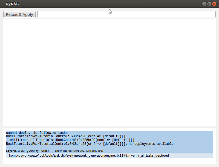
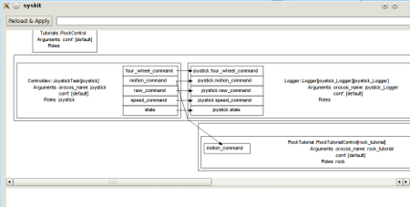
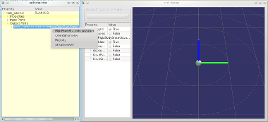
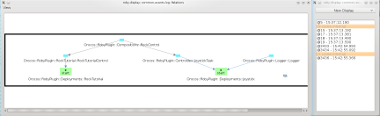

First composition

The result of this tutorial can be found in bundles/tutorials_scripts if you
followed the instructions at the bottom of <a href="../tutorials/index.html">this page</a>

<h2 id="abstract">Abstract</h2>

In this tutorial, you will learn how to write a simple model-based application,
and the most important tools that exist to run and debug it.

Note that this tutorial does require a (physical) joystick. The virtual joystick
won&rsquo;t work. However, if you don&rsquo;t have one, you can do everything in this
tutorial except running the generated component network. Moreover, the follow-up
tutorials will not need the joystick anymore, so if you don&rsquo;t have one, we
suggest that you go through this tutorial anyway (just reading the running part)
and go on with the follow-up tutorials.

<h2 id="a-first-model-based-script">A first model-based script</h2>

The root concept in Syskit is the <em>composition</em>. A
composition is a group of components that, once bound together, do something
useful. In our case, it would be moving the rock with a joystick. Create a new
file scripts/01_joystick.rb and add the following code:

<pre><code class="language-ruby">#### MODELLING
# This part does not need any running components
#
# Make the needed oroGen projects available. The names are
# oroGen project names.
using_task_library 'controldev'
using_task_library 'rock_tutorial'

module Tutorials
# Declare the composition
class RockControl &lt; Syskit::Composition
  # With one joystick. Note that the oroGen project names
  # are converted from snake_case to CamelCase (controldev
  # =&gt; Controldev, rock_tutorial =&gt; RockTutorial). This is
  # done consistently in the system management layer
  add Controldev::JoystickTask, :as =&gt; "cmd"
  # And one rock
  add RockTutorial::RockTutorialControl, :as =&gt; "rock"
  # Create any unique connection possible, by matching input
  # and output ports of the same data type. If ambiguities
  # exist, an error is generated
  cmd_child.connect_to rock_child
end
end

#### SYSTEM REQUIREMENTS
# This part specifies what should actually run
#
# Tell the system which deployments to use. The names are
# deployment names, i.e.  the name given to the deployment
# "deployment_name" blocks in oroGen projects
Syskit.conf.use_deployment 'joystick'

# Finally, ask the system to run such a composition
add_mission Tutorials::RockControl
</code></pre>

<h2 id="checking-the-script-and-running-the-network">Checking the script and running the network</h2>

As this <em>defines</em> a composition, it is possible to visualize it without
running anything. Without additional adaptation, though, you will hit an error when doing:

<pre><code>syskit instanciate scripts/01_joystick.rb
</code></pre>

This error might be visible in Syskit GUI or in console. 

<strong>(Click to enlarge)</strong>

This error tells you that there are <a href="../advanced_tutorials/100_deployments.html">no
deployments</a> available for the
oroGen component rock_tutorial::RockTutorialControl. There actually <em>are</em>
available deployments, but you need to tell Syskit which ones to use.

Make sure they are installed with

<pre><code>amake tutorial/orogen/tut_deployment
</code></pre>

You can then verify that there is indeed a deployment called &lsquo;rock_tutorial&rsquo; that
is available:

<pre><code>rock-inspect rock_tutorial::RockTutorialControl --show-deployments

==========================================================
Deployment name:  rock_tutorial
defined in tut_deployment
----------------------------------------------------------

------- rock_tutorial ------
Tasks
  rock_tutorial[rock_tutorial::RockTutorialControl]
    activity: Periodic, prio=lowest
    scheduler: non realtime,
  rock_tutorial_Logger[logger::Logger]
    activity: Triggered, prio=lowest
    scheduler: non realtime
</code></pre>

The new deployment can then be used in the script by adding, just after the
other use_deployment line:

<pre><code class="language-ruby">Syskit.conf.use_deployment 'rock_tutorial'
</code></pre>

Call again the instanciation with

<pre><code>syskit instanciate scripts/01_joystick.rb
</code></pre>

You should see a graphical representation of the system that would be executed by this script:

<strong>(Click to enlarge)</strong>

If you&rsquo;re happy with it, you can then run it with:

<pre><code>syskit run scripts/01_joystick.rb
</code></pre>

<strong>For people knowing Roby</strong> There is actually no difference between <code>roby run</code>
and <code>syskit run</code>.

In another shell, display the task using rock-display: 

<pre><code>rock-display
</code></pre>

<strong>(Click to enlarge)</strong>

and move your joystick

<h2 id="stopping-the-script">Stopping the script</h2>

The script can be stopped using CTRL+C. It shows a progression of the shutdown
procedure:

<pre><code>18:33:13.182 (Roby) control quitting. Waiting for 6 tasks to finish (6 tasks still in plan)
18:33:13.183 (Roby)   Logger::Logger:0x7f9eba6d36d8{conf =&gt; [default], orocos_name =&gt; joystick_Logger}[]
18:33:13.183 (Roby)   Controldev::JoystickTask:0x7f9eba73d088{conf =&gt; [default], orocos_name =&gt; joystick}[]
18:33:13.183 (Roby)   Deployments::Joystick:0x7f9eba7488e8{log =&gt; true, on =&gt; localhost}[]
18:33:13.183 (Roby)   RockTutorial::RockTutorialControl:0x7f9eba75c168{conf =&gt; [default], orocos_name =&gt; rock_tutorial}[]
18:33:13.184 (Roby)   Deployments::RockTutorial:0x7f9eba7687b0{log =&gt; true, on =&gt; localhost}[]
18:33:13.185 (Roby)   Tutorials::RockControl:0x7f9eba7cfde8{conf =&gt; [default]}[]
18:33:13.188 (Robot) interrupting Logger::Logger:0x7f9eba6d36d8
18:33:13.193 (Robot) interrupting Controldev::JoystickTask:0x7f9eba73d088
18:33:13.194 (Robot) interrupting RockTutorial::RockTutorialControl:0x7f9eba75c168
18:33:13.282 (Roby) waiting for 5 tasks to finish (5 tasks still in plan)
18:33:13.283 (Roby)   Logger::Logger:0x7f9eba6d36d8{conf =&gt; [default], orocos_name =&gt; joystick_Logger}[]
18:33:13.283 (Roby)   Controldev::JoystickTask:0x7f9eba73d088{conf =&gt; [default], orocos_name =&gt; joystick}[]
18:33:13.283 (Roby)   Deployments::Joystick:0x7f9eba7488e8{log =&gt; true, on =&gt; localhost}[]
18:33:13.283 (Roby)   RockTutorial::RockTutorialControl:0x7f9eba75c168{conf =&gt; [default], orocos_name =&gt; rock_tutorial}[]
18:33:13.284 (Roby)   Deployments::RockTutorial:0x7f9eba7687b0{log =&gt; true, on =&gt; localhost}[]
18:33:13.286 (Robot) stopped Logger::Logger:0x7f9eba6d36d8{conf =&gt; [default], orocos_name =&gt; joystick_Logger}[]
18:33:13.288 (Robot) stopped Controldev::JoystickTask:0x7f9eba73d088{conf =&gt; [default], orocos_name =&gt; joystick}[]
18:33:13.290 (Robot) stopped RockTutorial::RockTutorialControl:0x7f9eba75c168{conf =&gt; [default], orocos_name =&gt; rock_tutorial}[]
18:33:13.518 (Roby) waiting for 2 tasks to finish (2 tasks still in plan)
18:33:13.518 (Roby)   Deployments::Joystick:0x7f9eba7488e8{log =&gt; true, on =&gt; localhost}[]
18:33:13.518 (Roby)   Deployments::RockTutorial:0x7f9eba7687b0{log =&gt; true, on =&gt; localhost}[]
</code></pre>

<h2 id="what-happened-">What happened ?</h2>

Let&rsquo;s now have a look at what happened by visualizing the event log:

roby-display ./logs/current/common-events.log

<strong>(Click to enlarge)</strong>

The same display can be used at runtime, i.e. in parallel to the composition start the display with:

roby-display

Including when the controller is running on another host, with the --host
parameter:

<pre><code>roby display --host=remote_host
</code></pre>

<h2 id="summary">Summary</h2>

This tutorial showed you:

<ul>
<li>how to setup a model-based script (using_task_library and using_deployment)</li>
<li>how to define a composition</li>
<li>how to run the resulting script</li>
<li>how to graphically represent the result</li>
</ul>

The following tutorial will go a bit further, introducing the concept of <em>data
service</em>, which allows you to add a bit more of abstraction to your system.

Progress to the <a href="300_services.html">next tutorial</a> defining data services.

