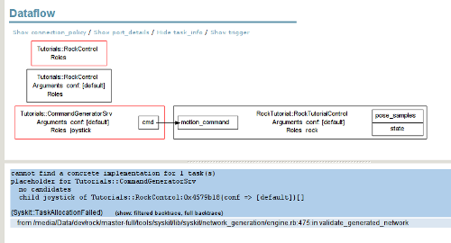
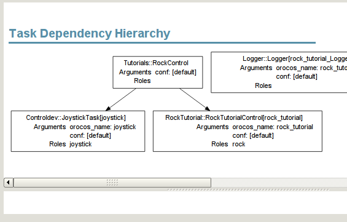
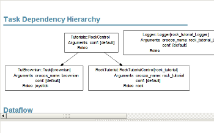

Going abstract - Data Services

The result of this tutorial can be found in bundles/tutorials_scripts if you
follow the instructions at the bottom of <a href="../tutorials/index.html">this page</a>

<h2 id="abstract">Abstract</h2>

In this tutorial, you will learn how to deal with <em>dependency injection</em> in Rock&rsquo;s
system management layer. This feature allows you to specify
abstract compositions, where some (or all) of the parts are not actual
component instances but just component models (classes of components).

In a more concrete manner, this tutorial will show you:

<ul>
<li>How to change the RockControl composition so that it can use any component
able to output a /base/MotionCommand2D type, instead of just a joystick and</li>
<li>how to select which command source should be used.</li>
</ul>

The next tutorial will then deal with the <em>runtime workflow</em> when using
Syskit, e.g. how to switch between different modalities / sources and how to
restart components that crashed.

<h2 id="data-services">Data Services</h2>

A data service describes two things:

<ul>
<li>The (minimum) expected interface, i.e. what input and output ports a component needs to have in order to support the service and</li>
<li>the expected functionality - what the component does with this data. This particular information is contained in the data service name.</li>
</ul>

For instance, a very common data service is the Base::PoseSrv service:

<ul>
<li>As its name implies, it generates poses.</li>
<li>As its definition requires (not shown here), it has a
<a href="../base_types.html">base::samples::RigidBodyState</a> output port.</li>
</ul>

Other services (i.e. the Base::OrientationSrv service) would have the same output port,
but their names would reflect the fact that they do something different.

<h2 id="abstracting-the-command-generator">Abstracting the command generator</h2>

In our case, we want to modify the result of the previous tutorial to allow the
selection of the command generator, i.e. being able to use different generators.

The first step is to define a generic data service and naming it &lsquo;CommandGeneratorSrv&rsquo;. Copy the
scripts/01_joystick.rb to scripts/02_services.rb and add the following at the top:

<pre><code class="language-ruby"># Load the types the data service requires
import_types_from 'base'
# Defines a data service model
module Tutorials
data_service_type 'CommandGeneratorSrv' do
  output_port 'cmd', '/base/MotionCommand2D'
end
end
</code></pre>

This defines a data service model that can be accessed with
Tutorials::CommandGeneratorSrv. These data services can be used in place of
actual task contexts to signify that a composition needs (in this case) &ldquo;some
component that generated a command&rdquo;. Let&rsquo;s use it in the composition:

<pre><code class="language-ruby">module Tutorials
# Declare the composition. The new model can be accessed with either
# Compositions::RockControl or Cmp::RockControl
class RockControl &lt; Syskit::Composition
  # Any command generator. We can omit the Tutorials:: prefix as RockControl
  # is defined in the same namespace
  add CommandGeneratorSrv, :as =&gt; "cmd"
  # And one rock
  add RockTutorial::RockTutorialControl, :as =&gt; "rock"
  # Create any unique connection possible, by matching input and output ports
  # of the same data type. If ambiguities exist, an error is generated
  cmd_child.connect_to rock_child
end
end
</code></pre>

and let&rsquo;s make the instanciation <em>fail</em>:

syskit instanciate scripts/02_services.rb

You&rsquo;ll get the following error, and you can see that some data services (red
boxes) are still present in the graphical representation of the network:

<pre><code>= cannot find a concrete implementation for 1 task(s)
| placeholder for DataServices::CommandGenerator
|   no candidates
|   child cmd of Compositions::RockControl:0x7fc2ff5df470{conf =&gt; [default]}[]
</code></pre>

Snapshot of <strong>syskit instanciate</strong> (Click to zoom in)

Remember: Data services are <em>abstractions</em> of components. They can therefore not
be executed (they are not actual components), and actual components must be
selected in their place.

The first part is to declare which components <strong>provide</strong> the service,
i.e. are valid choices for the data service. Add the following after the
using_task_library &lsquo;controldev&rsquo; statement:

<pre><code class="language-ruby">Controldev::JoystickTask.provides Tutorials::CommandGeneratorSrv, :as =&gt; 'cmd'
</code></pre>

This tells the system that an instance of controldev::JoystickTask
provides the service &lsquo;Tutorials::CommandGeneratorSrv&rsquo;. The service thus declared
must be given a name through the :as option. Syskit will verify that there are
ports on the task that match the ports of the data service.

Note that the port types are important for matching connections and port names do
not necessarily need to match between the service and the task. Syskit will map
the names automatically <em>if the mapping by type is unambiguous</em>. If multiple
ports could be used, it will check if there is one with the same name. If it is
not the case, an error is generated and you will have to specify the mapping
manually and try again.

syskit instanciate scripts/02_services.rb

Syskit knows only one component that provides the CommandGeneratorSrv service,
so it picked it up automatically and generated the expected network.

<h2 id="adding-a-random-motion-generator">Adding a random-motion generator</h2>

The <a href="https://gitorious.org/rock-tutorials">rock.tutorials</a> package set contains
the random-motion generator
(<a href="https://gitorious.org/rock-tutorials/orogen-tut_brownian">tutorials/orogen/tut_brownian</a>) that
we will now use as an alternative to the joystick.

First and foremost, when multiple oroGen projects start to be involved,
deployments quickly become hard to manage. The accepted workflow when you are
starting to build a complete system is to create a dedicated &ldquo;deployment
project&rdquo; that creates all the deployments that your system needs. In the case of
these tutorials, it is the <a href="https://gitorious.org/rock-tutorials/orogen-tut_deployment">tutorials/orogen/tut_deployment</a> oroGen project. Have
a look at it, and make sure that it is built in your installation by either
adding manually to autoproj/manifest or <a href="../tutorials/index.html#installing">by building the whole rock.tutorials
package set once and for all</a>

Let&rsquo;s now integrate the random motion generator. Modify scripts/02_services.rb
to get this new random movement generator task:

<pre><code class="language-ruby">using_task_library 'controldev'
using_task_library 'rock_tutorial'
using_task_library 'tut_brownian'
</code></pre>

and change the use_deployment lines to match:

<pre><code class="language-ruby">Syskit.conf.use_deployment 'rock_tutorial'
Syskit.conf.use_deployment 'joystick'
Syskit.conf.use_deployment 'brownian'
</code></pre>

We also have to declare that the random motion generator does provide the
CommandGeneratorSrv service. Add the following after the using_task_library
statements:

<pre><code class="language-ruby">TutBrownian::Task.provides Tutorials::CommandGeneratorSrv, :as =&gt; 'cmd'
</code></pre>

and let&rsquo;s make the instanciation fail again:

syskit instanciate scripts/syskit3.rb

This time, there is another error:

<pre><code class="language-text">= cannot find a concrete implementation for 1 task(s)
| placeholder for Tutorials::CommandGeneratorSrv
|   2 candidates
|     Controldev::JoystickTask,
|     TutBrownian::Task
|   child cmd of Tutorials::RockControl:0x7f6ff64c0780{conf =&gt; [default]}[]
</code></pre>

There are now two concrete tasks providing the
CommandGeneratorSrv service: The joystick and the random motion generator. Because
the selection is ambiguous, Syskit refuses to proceed and
bails out.

We therefore need to select it before the component network can be generated. In
order to do that, we need to give more details when adding the composition, i.e.
due to the two existing options for the CommandGeneratorSrv service, the
&lsquo;add_mission&rsquo; line at the end of the file is not specific enough anymore. We
additionally have to tell which task should be used in specific for the given
composition: 

<pre><code class="language-ruby"># Read this as: deploy a RockControl composition, using
# the TutBrownian::Task in places where it makes sense
add_mission Tutorials::RockControl.use(TutBrownian::Task)
</code></pre>

The ambiguity is now resolved and instanciating the component network will work just fine:

syskit instanciate scripts/02_services.rb

<h2 id="running-the-final-network">Running the final network</h2>

syskit run scripts/02_services.rb

<h2 id="conclusion">Conclusion</h2>

In this tutorial, you got started with using data services, i.e. description of
abstract components, and how to resolve ambiguities of different data sources at
requirement time (when calling &lsquo;add&rsquo;) instead of doing it at modelling time
(when creating the compositions)

The <a href="400_runtime_workflow.html">next tutorial</a> deals with the <em>runtime workflow</em> when using the
supervision: how to switch between different modalities / sources, how to
restart components that crashed, &hellip;

