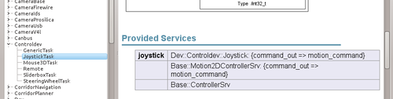
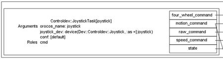
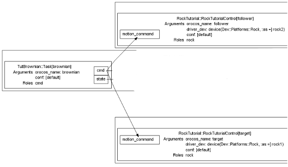

Devices

  
The result of this tutorial can be found in bundles/tutorials if you
followed the instructions at the bottom of <a href="../tutorials/index.html">this page</a>.
While the tip of the master branch contains the accumulated result of all the
tutorials, you can get the specific result of this one by checking out the
devices tag with

  <pre><code>git checkout devices
</code></pre>

So far, all components we have are equal, in the sense that they are seen by
Syskit as <em>transforming data</em>. From the point of view of Syskit, if three
components are needed in your network, everything is OK as long as you provide
enough deployments.

However, there is one case where this assumption simply does not work:
components that are related to hardware. Syskit cannot make a camera grow
because your network requires it.<a href="#fn:1" class="footnote">1</a> Morevoer, these devices are also your
system&rsquo;s data sources: the data that is simply processed by other components
originally comes from there.

For all these reasons, a Syskit-enabled system will in most cases have a robot
description block, in which devices are described. This tutorial will show you
how.

<h2 id="joystick-device">Joystick Device</h2>

The reason why the first tutorials asked you to remove the dependency on
the rock bundle by deleting config/bundle.yml is that the joystick, obviously,
is a device &ndash; and we would therefore have had to talk about devices way too
soon.

We will now delete models/orogen/controldev.rb, so that the one from Rock is
picked up<a href="#fn:2" class="footnote">2</a>. Then, run <code>syskit browse</code>, and have a look into the provided data
services of Controldev::JoystickTask.

It provides Dev::Controldev::Joystick, which is a device type,
and is declared in bundles/rock/models/orogen/controldev.rb with:

<pre><code class="language-ruby">module Dev
  module Controldev
    device_type 'Joystick' do
      provides Base::Motion2DControllerSrv
    end
  end
end
</code></pre>

What you can also see in the same file is that instead of using &lsquo;provides&rsquo; in
the task context definition, one uses device_type:

<pre><code class="language-ruby">class Controldev::JoystickTask
  driver_for Dev::Controldev::Joystick, :as =&gt; 'joystick'
</code></pre>

So far, this is the main difference between devices and data services:

<ul>
  <li>devices are defined using device_type instead of data_service_type</li>
  <li>one uses driver_for to declare that a task is a device driver instead of
provides to declare that it provides a data service</li>
</ul>

For now, this are the only differences. For all other intent and purposes, a
device type <strong>is</strong> a data service type.

<h2 id="robot-definition">Robot Definition</h2>

However, we also need to declare that we <strong>do</strong> have a joystick device. If we
don&rsquo;t, we will get an error from Syskit:

<pre><code>syskit instanciate -rtut joystick_def!
cannot find a device to tie to 1 task(s)
for Controldev::JoystickTask:0x3df5a18{conf =&gt; [default]}[]
  child cmd of Tutorials::RockControl:0x3dd3710{conf =&gt; [default]}[]
  no candidates for Controldev::JoystickTask:joystick
  (Syskit::DeviceAllocationFailed)
</code></pre>

Devices are declared within a robot block in profiles. Edit
models/profiles/rocks.rb and add the following to the Rocks profile:

<pre><code class="language-ruby">robot do
  device Dev::Controldev::Joystick, :as =&gt; 'joystick'
end
</code></pre>

as well as the obligatory loading code at the top of the file:

<pre><code class="language-ruby">using_task_library 'controldev'
</code></pre>

and finally select the device explicitly in the joystick definition:

<pre><code class="language-ruby">define 'joystick',    Tutorials::RockControl.
  use(joystick_dev).
  use_deployments(/target/)
</code></pre>

Et voila ! The joystick is declared. Test this out by running

<pre><code>syskit instanciate -rtut joystick_def!
</code></pre>

In the resulting network, have a look at the &lsquo;joystick_dev&rsquo; argument for the
JoystickTask task.

  
Devices are usable in profiles everywhere a data service type, task contexts,
compositions and/or definitions are. They are accessible by using the name_dev
notation (here: joystick_dev). For instance, one can select a particular device
in a use() statement: ControlLoop.use(joystick_dev). Running a device driver
from Syskit is done with e.g.

  <pre><code>syskit run -rtut joystick_dev!
</code></pre>

<h2 id="declaring-the-rocks-as-devices">Declaring the &lsquo;rocks&rsquo; as devices</h2>

As for the joystick, our tutorial rocks are also unique: they are &ldquo;physical&rdquo;. We
should therefore also declare them as devices, to uniquely identify them in the
network.

One tidbit: if you have tried, at some point, to run the brownian motion for
both rocks, you would have had a pretty hard time. The reason, as you may have
noticed right now, is that as long as you do not introduce a device in the
brownian motion networks, <strong>they are identical</strong>. Syskit will therefore happily
run a <em>single</em> brownian motion network, thus moving only one rock. What
will allow to differentiate them is that we point to a particular <strong>unique</strong>
device for each network to control.

The first step is to declare the device. <a href="../system/devices.html">The
convention</a> is to declare those in
models/blueprints/devices.rb, into the Dev module, so let&rsquo;s create the file and
add

<pre><code class="language-ruby"># Load the device file from the Rock bundle
require 'rock/models/blueprints/devices'
# Required for PoseSrv. Remember, this is
# given to you in syskit browse
require 'rock/models/blueprints/pose'
# Define the Rock device type. The 'platform' namespace is
# used to define whole platforms (e.g. the name of a commercial
# robot)
Dev::Platforms.device_type 'Rock' do
  # All Rock device drivers provide the Rock pose
  provides Base::PoseSrv
end
</code></pre>

Then, we need to declare our tutorial &lsquo;simulation&rsquo; component as a driver for
this device. Since the RockTutorialControl task is in the rock_tutorial oroGen
project, we edit models/orogen/rock_tutorial.rb and add

<pre><code class="language-ruby">require 'models/blueprints/devices'
class RockTutorial::RockTutorialControl
  driver_for Dev::Platforms::Rock, :as =&gt; 'driver'
end
</code></pre>

And, finally, we declare our two rocks and modify the network declarations. In
models/profiles/rocks.rb, the whole profile definition would look like

<pre><code class="language-ruby">profile 'Rocks' do
  robot do
    device Dev::Controldev::Joystick, :as =&gt; 'joystick'
    device(Dev::Platforms::Rock, :as =&gt; 'rock1').
      use_deployments(/target/)
    device(Dev::Platforms::Rock, :as =&gt; 'rock2').
      use_deployments(/follower/)
  end

  define 'joystick',    Tutorials::RockControl.
    use(joystick_dev, rock1_dev)
  define 'random',      Tutorials::RockControl.
    use(TutBrownian::Task, rock1_dev)
  define 'random2',      Tutorials::RockControl.
    use(TutBrownian::Task, rock2_dev)
  define 'random_slow', Tutorials::RockControl.
    use(TutBrownian::Task.with_conf('default', 'slow'), rock1_dev)
  define 'random_slow2', Tutorials::RockControl.
    use(TutBrownian::Task, rock1_dev).with_conf('slow')
  define 'leader', Tutorials::RockControl.
    use(TutBrownian::Task, rock1_dev)
  define 'follower', Tutorials::RockControl.
    use(TutFollower::Task, leader_def, rock2_dev)
end
</code></pre>

You can now have a look at all the networks. And for instance, you can

<pre><code>syskit instanciate -rtut random_def! random2_def!
</code></pre>

The result is probably not what you expected:

As stated when we introduced the device concept, devices are meant to identify
data sources and sinks &ndash; which are very commonly hardware devices in actual
robots. That&rsquo;s what the brownian generator is as well, so we would need to also
define a device for this one (this exercise is left to the reader ;-))

Let&rsquo;s also make the follower definition fail:

<pre><code>$ syskit instanciate -rtut follower_def!
Cannot find a concrete implementation for 1 task(s)
Syskit::TaskContext placeholder for Base::PoseSrv
  4 candidates
    Tutorials::RockControl/[cmd.is_a?(TutFollower::Task)],
    Tutorials::RockControl,
    Tutorials::RockControl/[cmd.is_a?(TutFollower::Task)],
    RockTutorial::RockTutorialControl
  child target_pose of Tutorials::RockControl/[cmd.is_a?(TutFollower::Task)]:0x48ce390{conf =&gt; [default]}[]
</code></pre>

This time, the main issue is that Syskit cannot pick something for the
target_pose child of the RockControl composition. Weird &hellip; We did give him
the leader_def definition in the use() statement.

Actually, not so weird: rock2_dev is also a provider for Pose, and there is
therefore conflict. As a general rule of thumb, if a data service is left
unallocated, it means that you have to explicitly state which child the model
you provided should replace, in our case, target_pose

<strong>Important</strong>: the explicit selections MUST go at the end of the use()
statement. This is required by the Ruby syntax. If you find this ordering
constraint confusing, you can also add multiple use() statements.

<pre><code class="language-ruby">define 'follower', Tutorials::RockControl.
  use(TutFollower::Task, rock2_dev, 'target_pose' =&gt; leader_def).
  use_deployments(/follower/)
</code></pre>

<h2 id="summary">Summary</h2>

This tutorial led through the reason why the concept of devices is needed when
using Syskit, and what you should define as devices. <a href="900_reusing_profiles.html">In the next
tutorial</a>, we will see how to split the profile
definitions between a generic profile and more specialized ones, for instance to
deal with real robot vs. simulated robot differences while reusing as much as
possible.

  <ol>
    <li id="fn:1">
      
to be perfectly clear, one could use Syskit to determine that (1) a new
  camera is required (2) reconfigure the hardware to install a new camera
  and (3) modify the Syskit models on the fly to reflect this change.
  However, that&rsquo;s not Syskit&rsquo;s job: its job is to determine that right here,
  right now, a required network cannot be deployed because one camera is
  missing. <a href="#fnref:1" class="reversefootnote">&#8617;</a>

    </li>
    <li id="fn:2">
      
when loading extension files in models/orogen, the first matching one in
  the dependency chain is picked. You can manually load the already existing
  one (if you want to do so) by adding the corresponding require line. <a href="#fnref:2" class="reversefootnote">&#8617;</a>

    </li>
  </ol>

