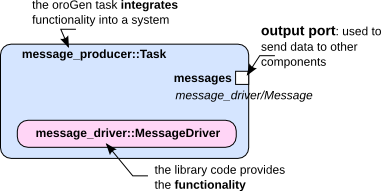

Creating components

<h2 id="abstract">Abstract</h2>

This tutorial will give you some hands-on experience on:

<ul>
 <li>how to model an oroGen component and embed a library</li>
 <li>how to run a component</li>
</ul>

If you don&rsquo;t want to execute the following steps by yourself, the result can also be found in &lsquo;~dev/tutorials&rsquo;.
For this tutorial it is assumed that your autoproj installation can be found in ~/dev.

The component we want to create will <strong>integrate</strong> the functionality of the
library developed <a href="100_basics_create_library.html">in the previous tutorial</a>, exposing that functionality into a
system.

The final component will look like:

This step-by-step tutorial will guide you through the process of:

<ul>
 <li>creating the oroGen component</li>
 <li>declaring the component interface</li>
 <li>adding the necessary C++ code for the component to pull data from the
message_driver library out to its output port.</li>
</ul>

<h2 id="creating-an-orogen-component">Creating an oroGen component</h2>

Rock provides the &lsquo;oroGen&rsquo; tool which allows you to create Orocos Realtime Toolkit (Orocos RTT) based components.
oroGen requires a simple specification to generate a skeleton, which can be filled with the functionality you require. 

There are multiple advantages for using oroGen:

<ul>
 <li>one can get an overview of the components without having to look at the
code, and without having to rely on up-to-date documentation</li>
 <li>you have the guarantee that your component(s) will be usable across the
complete Rock toolchain, from simple command-line execution to advanced
model-based system management</li>
</ul>

This tutorial does not cover all details of Orocos components but you will find further information in the <a href="../orogen/index.html">oroGen documentation</a>.

Similar to the creation of a library you create an oroGen component using the command &lsquo;rock-create-orogen&rsquo;. 

<pre><code class="language-text">~/dev$ rock-create-orogen tutorials/orogen/messages
</code></pre>

You will see the same configuration dialog as when calling rock-create-lib.
When you are asked for the dependencies, specify the library &lsquo;tutorials/message_driver&rsquo; which we have created
<a href="100_basics_create_library.html">in the previous tutorial</a>. If you missed this step, you can add this
dependency to the manifest file of the component manually.

<pre><code class="language-text">------------------------------------------
We require some information to update the manifest.xml
------------------------------------------
Brief package description
(Press ENTER when finished):
Message producer component
Long description:
This component will produce simple, timestamped messages
Author:
New user
Author email:
new-user@rock-robotics.org
Url (optional):

Enter your dependencies as a comma separated list.
Press ENTER when finished:
tutorials/message_driver
</code></pre>

As a convention, all oroGen components are created inside an orogen/ subfolder
of the corresponding library category. In this tutorial, the library and oroGen
packages are placed respectively in the tutorials/ and tutorials/orogen folders.
Moreover, when an oroGen component is created to integrate a library, it is
recommended to use the same name for the library and the orogen component, e.g.,
tutorials/driver_name and tutorials/orogen/driver_name. Note, however, that this tutorial
deviates from the standard practice since we will create multiple orogen components from
the driver library over the course of the tutorials.

<h3 id="define-tasks">Define tasks</h3>

The previous command creates a new folder <em>tutorials/orogen/messages</em>. Inside that folder, you find three files: manifest.xml, messages.orogen and messagesTypes.hpp.
The manifest.xml will have been filled with the information you provided already, but when you need to add additional dependencies to libraries or oroGen components, you will have to edit manifest.xml directly. Since you want to use your newly created library, check that your library has been added as a dependency.

<pre><code class="language-xml">&lt;depend package="tutorials/message_driver" /&gt;
</code></pre>

messages.orogen is the specification file of your new oroGen component, and allows you to define Orocos tasks.
We will now define a message producer and a message consumer component,
but this tutorial only refers to the message producer part.
The goal is to create a component which produces messages at a rate of 1 Hz, so the component only requires an output port for messages. 

Update messages.orogen as follows:

<pre><code class="language-ruby">name "messages"

using_library "message_driver"
import_types_from "message_driver/Message.hpp"

task_context "Producer" do
 needs_configuration

 output_port "messages", "message_driver/Message"
 periodic 1.0
end

task_context "Consumer" do
 needs_configuration

 input_port "messages", "message_driver/Message"
 port_driven 'messages'
end
</code></pre>

The specification contains a number of statements with the following meaning:

<ul>
 <li>name: defines the name of the component</li>
 <li>using_library: tells oroGen that this component requires, i.e. needs to link against the &lsquo;message_driver&rsquo; library</li>
 <li>import_types_from: tells oroGen to import all types in the given file</li>
 <li>task_context: everything within this block defines an Orocos task context
model, including that it needs to be configured before startup,
which input and output ports should be created, and a default value
for the runtime execution schema (every 1.0 second in this case)</li>
</ul>

The task has an output port called &lsquo;messages&rsquo; of the type &lsquo;message_driver/Message&rsquo;.
This type is initially unknown to the component, but it can be found in
&lsquo;Message.hpp&rsquo; of the &lsquo;message_driver&rsquo; library. In order to make types known to your component so that you
can use them in the specification, you have to do this explicitly with the
&lsquo;import_types_from&rsquo; statement. The using_library statement tells oroGen to
look for a library of the given name and link it to any binaries (UNIX processes) which deploy this task.
In this context, these binaries are called <a href="../orogen/deployment.html">deployments</a>.

The messagesTypes.hpp allows you to define additional C++-types. In this tutorial
we will not further touch the file.

<h3 id="integration-into-the-build-system">Integration into the build system</h3>

To finalize the package creation, one has to run <strong>rock-create-orogen</strong> again, but
this time without arguments and in the folder that contains the oroGen file.
This will create the initial layout of your package and initialize a git repository.
When your git configuration is incomplete, you might be requested to update your git settings via:

<pre><code>    git config --global user.email "you@example.com"
   git config --global user.name "Your Name"
</code></pre>

Then, you should add your component to the build system by adding the package to
autproj/manifest&rsquo;s layout section:

<pre><code class="language-text">package_sets:
 - github: rock-core/package_set

# Layout. Note that the rock.base, rock.toolchain
# and orocos.toolchain sets are imported
# by other rock sets.
layout:
 - rock.core
 - tutorials/message_driver
 - tutorials/orogen/messages
</code></pre>

And then call <strong>amake</strong> in the package&rsquo;s folder.

<pre><code class="language-text">amake
</code></pre>

If you get an error here, you most likely have a syntax error. In that case, please
compare your files against the files in the tutorial package set.

<h3 id="writing-the-task">Writing the task</h3>

Now that you have created the oroGen component, you can embed the functionality that the message_driver library provides in order to achieve a proper message producing component. 

The second call to <strong>rock-create-orogen</strong> created several new files. For now, you only need to care about the files in the <em>tasks</em> subfolder and you can safely ignore the <em>templates</em> folder for the moment.

Within the subfolder <em>tasks</em> of the created component, you will find two files: <em>Producer.hpp</em> and <em>Producer.cpp</em>. They contain the skeleton for the Orocos component that has been created. Within <em>Producer.hpp</em>, you will find the declarations of so-called hook methods: configureHook, startHook, stopHook, errorHook and cleanupHook. For this tutorial we will focus on the updateHook
(more information about these methods can be found <a href="../orogen/task_states.html">here</a>).

To add the message_driver functionality, add a forward declaration for message_driver and add a message_driver::MessageDriver member to the <em>Producer.hpp</em>:

<pre><code class="language-cpp">namespace message_driver {
   class MessageDriver;
}

namespace messages {
   class Producer : public ProducerBase
   {
       friend class ProducerBase;
   protected:
       message_driver::MessageDriver* mpMessageDriver;
...
</code></pre>

Include the header of the message driver and its allocation/deallocation to the constructor/deconstructor. Update <em>Producer.cpp</em> as follows:

<pre><code class="language-cpp">#include "Producer.hpp"
#include &lt;message_driver/MessageDriver.hpp&gt;
...

Producer::Producer(std::string const&amp; name)
   : ProducerBase(name),
   mpMessageDriver(new message_driver::MessageDriver())
{
}

Producer::Producer(std::string const&amp; name, RTT::ExecutionEngine* engine)
   : ProducerBase(name, engine),
   mpMessageDriver(new message_driver::MessageDriver())
{
}

Producer::~Producer()
{
   delete mpMessageDriver;
}
...
</code></pre>

Next, you will implement the updateHook. 
You will request a new message from the driver and write it to the output port &lsquo;messages&rsquo;. The port is identified by its name and a &lsquo;_&rsquo; which is prefixed to all orogen elements. The update port will be triggered at 1Hz. Both the name of the port and the periodicity have been specified in the <em>.orogen</em> file.

<pre><code class="language-cpp">void Producer::updateHook()
{
   ProducerBase::updateHook();

   message_driver::Message msg = mpMessageDriver-&gt;createMessage();
   _messages.write(msg);
}
</code></pre>

To build your first component call:

<pre><code class="language-text">amake tutorials/orogen/message_producer
</code></pre>

Or, assuming that you are in the message_producer folder or in one of its
subfolders, you can use

<pre><code class="language-text">amake
</code></pre>

<h2 id="run-it">Run it</h2>

Now, that you have a component ready to run, you probably want to see it running. Rock offers a ruby scripting interface for that purpose: <a href="../runtime/index.html">orocos.rb</a>
Create a subfolder &lsquo;scripts&rsquo; in the <em>messages</em> component (<em>~/dev/tutorials/orogen/messages</em>) and create a file <em>start.rb</em>.

<pre><code class="language-ruby">require 'orocos'
include Orocos

## Initialize orocos ##
Orocos.initialize

## Execute the task 'messages::Producer' ##
Orocos.run 'messages::Producer' =&gt; 'messages' do
 ## Get the task context##
 messages = Orocos.name_service.get 'messages'

 ## Configure the task
 messages.configure

 ## Start the task ##
 messages.start

 reader = messages.messages.reader

 puts 'Starting to read messages ...'
 while true
     if msg = reader.read_new
         puts "#{msg.time} #{msg.content}"
     end

     sleep 0.1
 end
end
</code></pre>

This script starts the default deployment of the producer part of the &lsquo;messages&rsquo; task (the second argument behind Orocos.run gives the name to access it in the Orocos.run body). Once the producer has been created, the task can be accessed using &lsquo;Orocos.name_service.get&rsquo;. Having the reference to the task context allows you to access its elements and to configure and start the task. Now, just run the script using Ruby.

<pre><code class="language-text">amake

ruby start.rb
</code></pre>

The script prints only new messages which are provided by the producer. Since you set the periodicity to 1 second, messages should show only every 1s. 

<pre><code class="language-text">Starting to read messages ...
Tue Aug 02 16:43:48 +0200 2011 Message from MessageDriver
Tue Aug 02 16:43:49 +0200 2011 Message from MessageDriver
</code></pre>

Stop the script with CTRL+C. The script will stop the component process by
itself, which would also happen if you had an error in the script itself.

<h2 id="summary">Summary</h2>

In this tutorial you have learned: 

<ul>
 <li>How to create a simple oroGen component,</li>
 <li>how to embed a library into an oroGen component and</li>
 <li>how to use Ruby to start oroGen components.</li>
</ul>

Now that you have a rough idea of what oroGen is and what it can do,
we recommend that you have a look at the <a href="../orogen/orogen_cheat_sheet.pdf">oroGen cheat sheet</a>.

In the next tutorial you will learn more about task configuration.

Progress to the <a href="120_basics_configure_component.html">next tutorial</a>.

