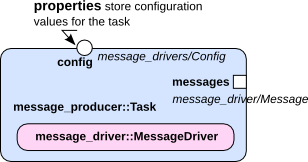

Configure components

<h2 id="abstract">Abstract</h2>

This tutorial will give you some hands-on experience on:

<ul>
  <li>How to add configuration support for your component and</li>
  <li>how to embed that configuration into the Ruby script.</li>
</ul>

Components and underlying libraries often need to be configured before starting them. This tutorial will teach you
how to use the oroGen component&rsquo;s properties to map to your library configuration option, and how to add the functionality
to the oroGen component. 

At the end of this tutorial, the component will look like:

Let&rsquo;s go back into the MessageDriver library:

acd message_driver

<h2 id="configure-a-component">Configure a component</h2>

Some libraries will require configuration before you can use them, e.g. here we want to add a property to the MessageDriver library to
configure if the produced message should be presented in uppercase or not.
Therefore, &ldquo;cd&rdquo; into the message driver library (<em>~/dev/tutorials/message_driver</em>).

Add the configuration object code to <em>src/Config.hpp</em> in the message
driver library:

<pre><code class="language-cpp">#ifndef _MESSAGE_DRIVER_CONFIG_HPP_
#define _MESSAGE_DRIVER_CONFIG_HPP_

namespace message_driver
{

/**
* This configuration struct is a simple example of what you
* can do in order to wrap multiple configuration properties
* into a single object
*
* This way you can manage configuration properties by grouping
* them into struct, and you don't have to change the oroGen
* components interface when your configuration object changes
*/
struct Config
{
        bool uppercase;

        Config()
            : uppercase(false)
        {
        }

};

}
#endif // _MESSAGE_DRIVER_CONFIG_HPP_
</code></pre>

Then adapt the message driver class (in <em>src/MessageDriver.cpp</em> and
<em>src/MessageDriver.hpp</em>):

<em>MessageDriver.hpp:</em>

<pre><code class="language-cpp">#include &lt;message_driver/Message.hpp&gt;
#include &lt;message_driver/Config.hpp&gt;
	...

        /**
        * MessageDriver configuration
        * \param config Configuration object
        */
        MessageDriver(const Config&amp; config = Config());

	...
private:
        Config mConfig;

</code></pre>

<em>MessageDriver.cpp:</em>

<pre><code class="language-cpp">...
#include &lt;algorithm&gt;
...

Message MessageDriver::createMessage()
{
        Message msg("Message from MessageDriver");

        if(mConfig.uppercase)
            std::transform(msg.content.begin()
	    	 , msg.content.end()
	         , msg.content.begin()
	         , toupper);

        return msg;
}

...

MessageDriver::MessageDriver(const Config&amp; config)
        : mConfig(config)
{
}

...
</code></pre>

<h3 id="update-the-build-configuration-in-srccmakeliststxt">Update the build configuration in src/CMakeLists.txt</h3>

This makes sure that the configuration header will also be installed.

Remember: The build configuration can be found here:

<em>~/dev/tutorials/message_driver/src/CMakeLists.txt</em>

Update the file as follows:

<pre><code class="language-text">rock_library(message_driver
    SOURCES MessageDriver.cpp
    HEADERS MessageDriver.hpp Message.hpp Config.hpp
    DEPS_PKGCONFIG base-types)
</code></pre>

<h3 id="embed-the-configuration-property-into-the-orogen-component">Embed the configuration property into the oroGen component</h3>

Since we want a specific configuration step, the new
task should not be started without configuration, which should already have been
set by adding the statement &lsquo;needs_configuration&rsquo; in the task description in the orogen file.

In order to embed the configuration property into the oroGen component, we will
have to do the following steps:

<ol>
  <li><strong>declare</strong> the property in the messages.orogen specification file (in <em>~/dev/tutorials/orogen/messages</em>).</li>
  <li><strong>move</strong> the construction/destruction of the driver from the task&rsquo;s
constructor and destructor into configureHook / cleanupHook.</li>
</ol>

The final version of the component&rsquo;s code is in branch &lsquo;with_config&rsquo; of <em>basic_tutorials/orogen/message_producer</em> (<em>git checkout with_config</em>). 

<strong>(1)</strong> We modify the task description in the messages.orogen file.
We add a property of the configuration type as follows (see also <a href="../orogen/task_interface.html">Task
Interface</a>).

<strong>(2)</strong> Since we want a specific configuration step, the new
task should not be started without configuration, i.e. this is why we add the
statement &lsquo;needs_configuration&rsquo;.

<pre><code class="language-ruby">import_types_from "message_driver/Config.hpp"

task_context "Producer" do
  needs_configuration

  property "config", "message_driver/Config"
  ...

task_context "Consumer" do
  needs_configuration

  property "config", "message_driver/Config"
  ...
end
</code></pre>

<strong>(2)</strong> Finally, we remove the allocation and deallocation from the constructor and destructor, since it will be moved into the configureHook and the cleanupHook:

In <em>~/dev/tutorials/orogen/messages/tasks/Producer.cpp</em>:

<pre><code class="language-cpp">bool Producer::configureHook()
{
    if (! ProducerBase::configureHook())
        return false;

    message_driver::Config configuration = _config.get();
    mpMessageDriver = new message_driver::MessageDriver(configuration);

    return true;
}
</code></pre>

<pre><code class="language-cpp">void Producer::cleanupHook()
{
    ProducerBase::cleanupHook();

    delete mpMessageDriver;
}
</code></pre>

<h3 id="build-the-task">Build the task</h3>

Now, build the task: Assuming that you are in the message_producer folder or in one of its
subfolders call:

<pre><code class="language-cpp">amake
</code></pre>

<h3 id="embedding-configuration-into-the-ruby-script">Embedding configuration into the ruby script</h3>

Now, &ldquo;cd&rdquo; into your folder <em>~/dev/tutorials/orogen/messages/scripts</em>,
and copy &lsquo;start.rb&rsquo; to a new file &lsquo;configure.rb&rsquo; -
you will reuse &lsquo;start.rb&rsquo; at a later stage.
Modify &lsquo;configure.rb&rsquo; according to the following
code block:

<pre><code class="language-ruby">require 'orocos'

include Orocos
Orocos.initialize

Orocos.run 'messages::Producer' =&gt; 'messages' do

    messages = Orocos.name_service.get 'messages'

    # 'config' is the name of the property
    messages.config do |p|
        p.uppercase = true
    end

    # Call to configure is required for this component
    # since it has been generated with 'needs_configuration'
    messages.configure
    messages.start

    reader = messages.messages.reader

    while true
        if msg = reader.read_new
            puts "#{msg.time} #{msg.content}"
        end

        sleep 0.5
    end
end
</code></pre>

<h3 id="run-it">Run it</h3>

Now you can run the script. 

<pre><code class="language-cpp">ruby configure.rb
</code></pre>

Again, you should see something similar to the following. You can switch
between uppercase and mixed case printing by using your newly defined configuration options. With the script above, you should see something like the following:

<pre><code class="language-text">Wed Aug 03 09:40:28 +0200 2011 MESSAGE FROM MESSAGEDRIVER
Wed Aug 03 09:40:29 +0200 2011 MESSAGE FROM MESSAGEDRIVER
</code></pre>

<h3 id="use-a-configuration-file">Use a configuration file</h3>

Property values can be read from a file, what is especially handy in case of more properties to set. The configuration file is a yaml-file which organises the properties in a structured way. For the present example, create a file, e.g. <em>messages_config.yml</em> with the
following content:

<pre><code class="language-yaml">--- name:default
config:
    uppercase: True
</code></pre>

Note that yaml uses indentation for organizing the data. The script can now be changed to use this file. Instead of

<pre><code class="language-ruby">    # 'config' is the name of the property
    messages.config do |p|
        p.uppercase = true
    end
</code></pre>

put

<pre><code class="language-ruby">    # load property from configuration file
    messages.apply_conf_file("messages_config.yml", ["default"])
</code></pre>

The result when running the script should be the same as above. It is possible to
have one configuration file per task context and then load the properties for each task
from the corresponding file. Of course the properties in the file have to match the
properties given in the orogen definition. A good way to create a proper configuration
file is to generate such a file from the task model definition. To do so, run the
following command from the shell:

<pre><code class="language-sh">oroconf extract messages::Producer --save messages.yml
</code></pre>

<em>oroconf</em> is the command to access the configuration of tasks. It can do more than
extracting configuration files (<em>--help</em>), but we will stick to the command <em>extract</em>
for now. The first argument after <em>extract</em> gives the task model which is the orogen
name plus double colon plus task name. Behind <em>--save</em>, the file is given to which the
data should be written. You might note that there are some variations to the hand
written file:

<pre><code class="language-yaml">--- name:default
# no documentation available for this property
config:
  uppercase: false
</code></pre>

In this file, <strong>uppercase</strong> is <em>false</em>, which is the default
setting for the property (see configuration constructor). A comment before the declaring
the property is automatically picked up as documentation line.

<pre><code class="language-ruby">    # Configuration property for the message driver
    property("config","message_driver/Config")
</code></pre>

The first line is the name for the configuration. It is possible to have multiple
configurations in one file which can be distinguished by their name. Think of a
file called &lsquo;messages_multi.yml&rsquo;:

<pre><code class="language-yaml">--- name:default
# Configuration property for the message driver
config:
  uppercase: 0

--- name:uppercase
# Configuration property for the message driver
config:
  uppercase: 1
</code></pre>

Then one can apply the uppercase configuration with

<pre><code class="language-ruby">    # load property from configuration file
    messages.apply_conf_file("messages_multi.yml",
        ["uppercase"])
</code></pre>

For more information on configuration files, have a look <a href="../runtime/configuration.html">here</a>.

<h3 id="dynamic-properties">Dynamic properties</h3>

&ldquo;Normal&rdquo; properties - such as the ones dealt with in the preceding tutorial -
should only be used for the starting configuration of the component and should
not be changed at runtime. If a component allows dynamic changes of properties,
those have to be declared explicitly as explained hereafter. 

The framework automatically creates a callback function which is called
within the task&rsquo;s thread. This function makes it possible that changes of
properties can be accepted or rejected if they are invalid.

In the messages.orogen file, a dynamic property must be declared as
follows:

<pre><code class="language-ruby">property("some_dynamic_property","double",0.1).dynamic
</code></pre>

Inside the task, the declared function will look as follows:

<pre><code class="language-cpp">bool Task::setSome_Dynamic_Property(double value)
{
 //Implement the needed steps here
 return(orogen_name::TaskBase::setSome_Dynamic_Property(value));
}
</code></pre>

Note that if you modify a task which already exists, the code must be copied out
of the <em>templates/tasks</em> folder!

The base class is called to make sure that superordinated tasks are called and
properties can be changed by those tasks. If a superordinated task rejects the
changes, the return value should be <em>false</em>.

If the task has not yet been configured, consequently is not in a <em>running</em>
or <em>stopped</em> state, the callback will NOT be triggered in case of an external
change of the property. What will happen, in that case, is that the property
<em>_some_dynamic_property</em> will be updated.

As a simplification for the user, if a task has dynamic properties, a callable
function is generated  which calls all callback functions with the new
parameters. By calling <em>updateDynamicProperties()</em> inside the configure hook
after the component is set up, the changes of the dynamic properties can be
applied, avoiding code duplication.

<h4 id="special-case-inheriting-tasks">Special case inheriting tasks</h4>

If a non-dynamic property shall become dynamic inside the inheriting task, it
must be declared as follows in the messages.orogen file:

<pre><code class="language-ruby">make_property_dynamic("some_non-dynamic_property")
</code></pre>

<h2 id="summary">Summary</h2>

In this tutorial, you have learned: 

<ul>
  <li>How to embed configuration into an oroGen component.</li>
  <li>How to use the <em>templates/</em> subfolder of an oroGen component.</li>
  <li>How to set configuration properties for your component in a ruby script.</li>
  <li>How to generate and use configuration files.</li>
</ul>

In the next tutorial, you will learn how to create a data driven component and how to connect it
to an existing component.

Progress to the <a href="130_basics_connect_components.html">next tutorial</a>.

