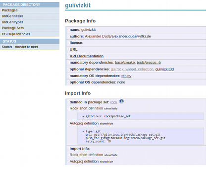

Installing Packages

<h2 id="abstract">Abstract</h2>

In this tutorial, you will learn how to install the rock widget collection
and Vizkit which are libraries for displaying online data and log data.

<h2 id="finding-available-packages-and-orogen-tasks">Finding available packages and oroGen tasks</h2>

Rock&rsquo;s <a href="../../package_directory.html">package directory</a> gives you a general
overview of available &lsquo;standard&rsquo; packages, oroGen tasks and types that are used
on oroGen tasks. It also gives you links to the API documentation for packages
that provide one. Go have a look.

<h2 id="package--package-sets">Package / Package Sets</h2>

Every repository which contains libraries, widgets, plugins, orogen tasks or orogen deployments
is called a package. They are organised in package sets which define for autoproj how to download
and install the containing packages.

In this case, we want to install two libraries called &lsquo;vizkit&rsquo; and &lsquo;rock_widget_collection&rsquo;. For this we first
check if the packages are already installed or defined in one of the known package sets. To do so,
call on the command line (do not forget to source env.sh first):

<pre><code>autoproj list-config rock_widget_collection
autoproj list-config vizkit
</code></pre>

If the packages are known to autoproj, but not installed, autoproj will report that <em>the following
packages are not installed:</em>. In this case you can jump to the section below <a href="#installing-packages">Installing Packages</a>.

If autoproj reports that it cannot find a match for the packages, go to the section <a href="#adding-package-sets">Adding Package Sets</a>

If both packages are already installed, autoproj will show a list of packages and dependencies for gui/vizkit and gui/rock_widget_collection.
Of course, this should not keep you off from reading the next two sections.

<h2 id="adding-package-sets">Adding Package Sets</h2>

It is assumed that autoproj does not know the desired packages at all. In this
case, you have to tell autoproj where it can find the package sets which contain
the desired packages. An easy way to figure out which package set contains
which package is by looking
<a href="../../pkg/index.html">at the package index</a>
. After having found the desired package, copy the displayed rock <em>short definition</em>
string into the file autoproj/manifest of the current autoproj installation (click &lsquo;show/hide&rsquo;). If you are not using the
default rock installation, you can also use the displayed <em>autoproj definition</em> string which is independent of
rock.

In our case, the website is reporting the following string for the package gui/vizkit
which tells autoproj where to find the corresponding package set which in our case
also luckily contains the rock_widget_collection.
To add this package set to your current autoproj installation, copy the string to the
<em>package_sets:</em> section of the file autoproj/manifest.

<strong><em>NOTE</em></strong>: The manifest is following the yml syntax where you have to use blanks (no tabs).

<pre><code class="language-yaml">package_sets:
- github: rock/package_set
</code></pre>

Now autoproj knows all packages which are part of the rock package sets. If you want to install one of them,
go on to the next section.

<h2 id="installing-packages">Installing Packages</h2>

It is assumed that autoproj knows the desired packages and <em>autoproj list-config package_name</em> reports
that they are not checkout. If autoproj does not find a match for your desired package, go to the section above.

To tell autoproj to install known packages, you have to add them to the layout section of
the file <em>autoproj/manifest</em> of the current autoproj installation. 

In this case, we want to install the libraries &lsquo;vizkit&rsquo; and &lsquo;rock_widget_collection&rsquo;. For this, add the following
two lines to the <em>autoproj/manifest</em> layout section. 

<strong><em>NOTE</em></strong>: The manifest is following the yml syntax where you have to use blanks (no tabs).

<pre><code class="language-yml">layout:
- gui/vizkit
- gui/rock_widget_collection
</code></pre>

Now, if you call <em>amake</em> on the command line, autoproj will download and install the two libraries. 

<pre><code>amake
</code></pre>

If you want to check if everything went fine, in this case, open a new terminal, go to the
autoproj installation, source the environment (<em>source env.sh</em>) and call
<em>rock-replay</em> on the command line. A file browser should open and you should see a small help, how to use the
command line tool, otherwise vizkit was not installed.

<pre><code>source env.sh
rock-replay
</code></pre>

<h2 id="further-reading">Further reading</h2>

<a href="../autoproj/advanced/creating_pkg_set.html">Learn how to create your own package set</a>

<a href="../autoproj/advanced/importers.html">Learn more about the import of source packages and the source.yml file</a>

<a href="../autoproj/advanced/autobuild.html">Learn how to write your own autobuild scripts</a>

<a href="../autoproj/advanced/writing_package_handlers.html">Learn how to write your own package handlers</a>

<a href="../autoproj/advanced/osdeps.html">Learn more about the relationship between source packages and osdeps packages</a>

<h2 id="summary">Summary</h2>

In this tutorial, you have learned to: 

<ul>
<li>Browse packages in the Rock package directory,</li>
<li>find an oroGen task that provides or consumes a given datatype and</li>
<li>install the package.</li>
</ul>

Progress to the <a href="200_display_logging_and_replay.html">next tutorial</a>.

