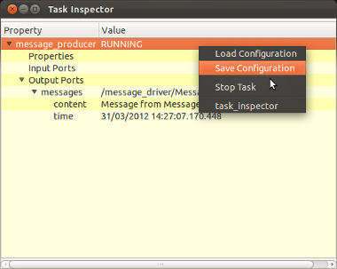
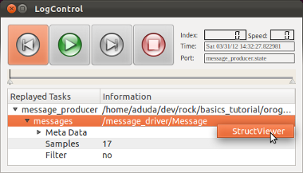

Viewing The Data (Live / Log Files)

<h2 id="abstract">Abstract</h2>

In this tutorial, you will learn how to examine your task, have a look at and
log data produced by orogen tasks and finally how to replay them.

<h2 id="task-inspector">Task Inspector</h2>

While running a task, you can examine the task with the <em>Task Inspector</em>.

<ul>
 <li>Open another console (don&rsquo;t forget to do &lsquo;. env.sh&rsquo; there)</li>
 <li>Start your message_consumer script from the previous tutorial (<em>~/dev/tutorials/orogen/messages/scripts/connect.rb</em>)</li>
 <li>In the other console, start the task inspector with <em>rock-display message_producer</em></li>
</ul>

You will see the task inspector showing the message producer task. When you click it, the entry expands and shows a property section, input port section and an output port section. The output port section also shows the port called <em>messages</em>. When you click on an output port, the data sent by the port is being displayed, which allows you to examine it. 

If started without arguments, the task inspector shows up all running tasks after
some delay (to select a different Corba Name Service than the local one, use the
option --host). A right-click on any output port or subtype allows to open available plugins able to display the selected data structure (if you wish to add your custom plugins, see &lsquo;Writing a Vizkit Plugin&rsquo;).

<h2 id="logging-data">Logging Data</h2>

By default, all tasks come with a logger component that allows writing the data of the output ports to a file.

<strong>Activating logging:</strong> You can activate the logging by calling the ruby
method <em>log_all</em> from your ruby start script. If you only want to log the
ports or the properties of the tasks you can also call the methods
<em>log_all_ports</em> or <em>log_all_configuration</em> instead.

<pre><code class="language-ruby">...

Orocos.run 'message_producer::Task' =&gt; 'message_producer',
   'message_consumer::Task' =&gt; 'message_consumer' do
 Orocos.log_all
 message_producer = Orocos.name_service.get 'message_producer'
 message_consumer = Orocos.name_service.get 'message_consumer'

...
</code></pre>

By default, all the logged data goes to log files called <em>your_task_name.x.log</em> in
the current working directory. In this case, all the logged data goes to 
message_producer.0.log. There is also a file message_consumer.0.log which
holds no data since the task has no output port. The digit in the end
increases automatically.

<h2 id="rock-replay">rock-replay</h2>

Rock is shipped with a command line tool for displaying the content of log
files. Therefore, if you want to look into a log file without replaying it to
the framework, you can call <em>rock-replay log_file.x.log</em> to get a graphical
overview of the logged data. By double clicking on a port name, Vizkit is
trying to find a widget plugin to display the data. If it cannot find one,
vizkit is using a generic struct viewer widget to display the content of the
sample (if you wish to add your custom plugins, see &lsquo;Writing a Vizkit Plugin&rsquo;).
To display the log file recorded above, call:  

<em>rock-replay message_producer.0.log</em>

<h2 id="summary">Summary</h2>

In this tutorial, you have learned to: 

<ul>
 <li>Examine a live task with rock-display,</li>
 <li>activate logging and</li>
 <li>visualize the logged data using rock-replay.</li>
</ul>

Progress to the <a href="500_simulate_a_robot.html">next tutorial</a>.

